# Abstract

To fight against prevalent cyber threat, more mechanisms to protect operating systems have been proposed. Specifically, approaches like DEP, ASLR, and RELRO are frequently applied on Linux to hinder memory corruption vulnerabilities. In other words, it is more difficult for adversaries to exploit bugs to undermine the system security.

In this paper, we will propose a new attack technique that exploits the FILE structure in GNU C Library (Glibc), and introduce how to circumvent the protection adopted by modern operating systems. We will demonstrate techniques to break data protections and launch remote code execution. Moreover, we explore the methodology to utilize different FILE structures for attack – the so called File Stream Oriented Programming.

Despite the new mitigations in the latest version of Glibc, we will show we can still abuse the FILE structure using our approach.

# Table_of_Contents

- [Abstract](#Abstract)
- [Table of contents](#Table_of_Contents)
- [Chapter 1 Introduction](#Chapter_1_Introduction)
- [Chapter 2 Background](#Chapter_2_Background)
	- [2.1 FILE stream](##2.1_FILE_stream)
	- [2.2 FILE structure](##2.2_FILE_structure)
	- [2.3 FILE stream related function](##2.3_FILE_stream_related_function)
- [Chapter 3 Exploitation of FILE structure](#Chapter_3_Exploitation_of_FILE_structure)
	- [3.1 Abuse the FILE structure to code execution](##3.1_Abuse_the_FILE_structure_to_code_execution)
	- [3.2 File-Stream Oriented Programming](##3.2_File-Stream_Oriented_Programming)
	- [3.3 Vtable verification in FILE structure](##3.3_Vtable_verification_in_FILE_structure)
	- [3.4 Make FILE Structure great again](##3.4_Make_FILE_Structure_great_again)
		- [3.4.1 Arbitrary memory reading](###3.4.1_Arbitrary_memory_reading)
		- [3.4.2 Arbitrary memory writing](###3.4.2_Arbitrary_memory_writing)
		- [3.4.3 Control the world](###3.4.3_Control_the_world)
		- [3.4.4 No File operation case](###3.4.4_No_File_operation_case)
		- [3.4.5 Another bypass method](###3.4.5_Another_bypass_method)
		- [3.4.6 Another platform](###3.4.6_Another_platform)
- [Chapter 4 Conclusion](#Chapter_4_Conclusion)

# Chapter_1_Introduction

In the past, memory corruption such as buffer overflow is a common vulnerability that gives attackers a chance to gain control. At the beginning, the program has no protection so that the attack exploited very easy. After a while, DEP (Data Execution Protection) and ASLR (Address space layout randomization) have been present and implemented. But the attacker does not show weakness, they developed some attack method such as GOT hijack and ROP (Return-Oriented Programming). After a time, the defense also developed Full RELRO and Stack Guard to prevented GOT hijack and stack overflow. It effectively blocked most attack. Therefore, FILE structure became a good target to gain control execution flow. We could forge the FILE structure and virtual function table which contains functions to lead file stream related function such as `fopen` to execute our code. In this paper, we will use a simple case to show you how to use FILE structure to exploit a binary on Linux platform and use the feature of FILE structure to do oriented programming. 

In the modern, more and more protection added to GNU C Library. FILE structure was also added virtual function protection to validate if the virtual function call is valid. We will introduce the new protection in GNU C library and demonstrate how to make FILE structure exploit great again and then control instruction pointer again and again.

# Chapter_2_Background

## 2.1_FILE_stream

File stream is very important concept in C and a common, logical interface to the various devices that comprise the computer.

When we use a raw IO function in C program to read or write a file, kernel would not read or write the file directly. Instead, kernel would handle a kernel buffer, and read a lot of data in the file to the buffer. Then it would be copied to your destination address in user space as you want to read or write. The purpose is to reduce the number of hard disk read/write. In would increase the performance in the file operation.

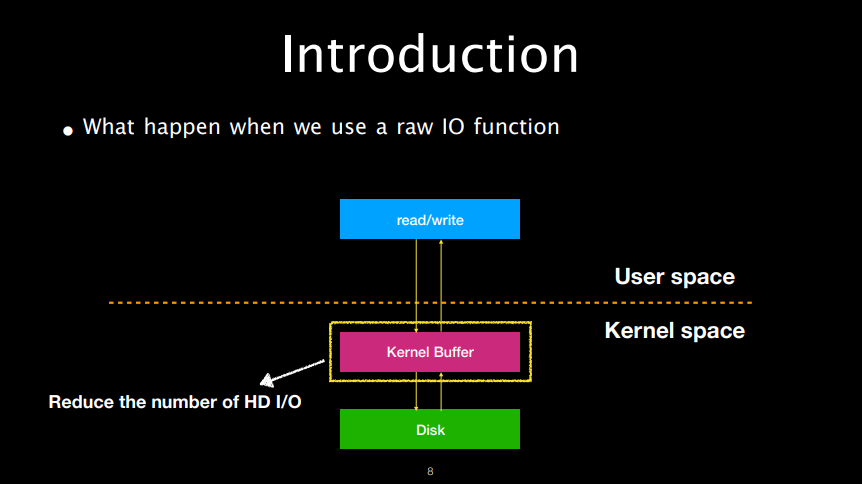

Glibc is also added a similar mechanism called file stream. File stream is a higher-level interface on the primitive file descriptor facilities. As C defines the term "file", it can refer to a disk file, the screen, the keyboard, a port, a file on tape, and so on. Although files differ in form and capabilities, all streams are the same. The stream provides a consistent interface and to the programmer one hardware device will look much like another.

A stream is linked to a file using an open operation. Characters that are written to a stream are normally accumulated and transmitted asynchronously to the file in a block, instead of appearing as soon as they are output by the application program. A stream is disassociated from a file using a close operation.

In other word, when we use fread or fwrite to read or write a file. It would create a buffer in the user space. Just like system call, it would also read a lot of data from kernel buffer to stream buffer.

After that, data would be copied to your destination as you want to read or write. The goal is to reduce the number of system call, and it also reduce the number of times system traps to kernel.

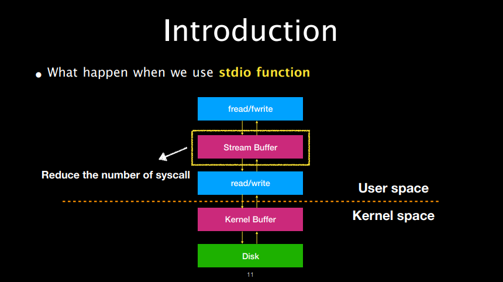

## 2.2_FILE_structure

FILE structure is a very complex structure. In this paper, we will introduce some important element in FILE structure.

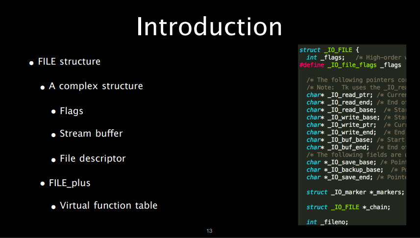

`_flags` in the file structure is used to record the attribute of File stream such as read only, append and so on. It also shows the status of the file buffering status.

Stream buffer pointer can be divided into three parts, `read buffer (_IO_read_ptr, _IO_read_end, _IO_read_base)`, `write buffer (_IO_write_ptr, _IO_write_end, _IO_write_base)` and `reserve buffer(_IO_buf_base, _IO_buf_end)`. The pointer ending is `ptr` is point to current buffer position. The pointer ending is `base` is point to the begin of the buffer and the pointer ending is `end` is point to end of buffer.

`_fileno` is a file descriptor from the file which you open. It’s return from system call open. Especially 0,1 and 2 is standard input, output and error.

`_IO_file_plus` is an extension of FILE structure. It added a virtual function table but FILE does not have. In the recent GNU C Library version, FILE stream uses the file plus structure. Stdin, stdout and stderr are also using the structure. For all file operations are through virtual function table in FILE structure. If you want to read data from file, it would call the virtual function instead of direct call into original function. That is used for overriding for some special case such as wide character.

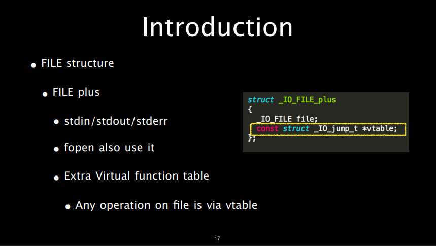

Interestingly, every FILE structure is associated with a linked list. The head of linked list is called `_IO_list_all` and the next pointer is called `_chain`.

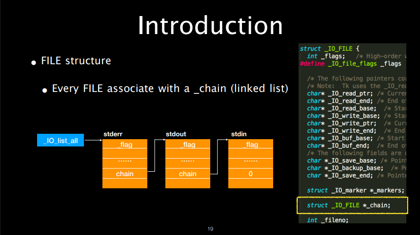

## 2.3_FILE_stream_related_function

In this part, we will take a few common functions in the file stream to demonstrate how the file stream works.

- The workflow of `fopen`:

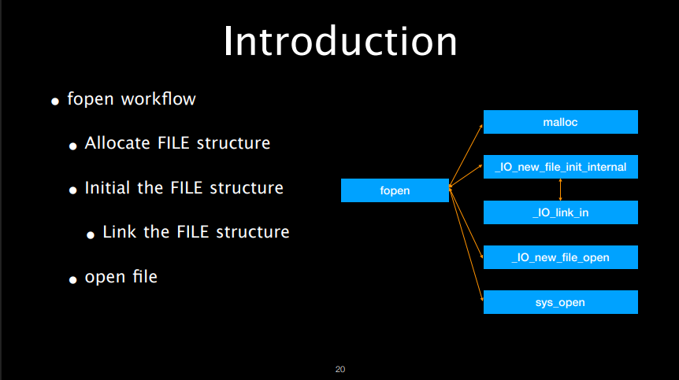

First of all, GNU C library would allocate a memory space for FILE structure when you call fopen. Then it would initialize element in the FILE structure, such as `_flag` and virtual function table. It very like the constructor in C++ object. After that, it would insert the FILE structure into the linked list of FILE stream. Eventually, it would call system call open and then fill in the fileno.

- The workflow of `fread`:

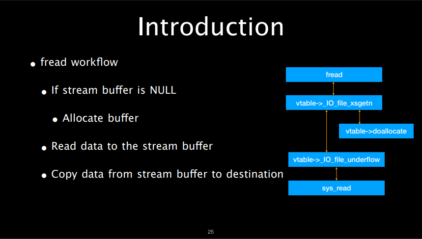

From here on, it would start using virtual function for file operations. At the beginning of fread, if the stream buffer is not created we called it NULL, it would use `_file_doallocate` in virtual function table to allocate a new buffer for FILE stream. `_file_doallocate` would use `malloc/mmap` or your defined memory allocator to allocate the stream buffer. Then fread would use system call to read a lot of data a from file to the stream buffer. Finally, it would copy data which you want to read from stream buffer to destination.

- The workflow of `fwrite`:

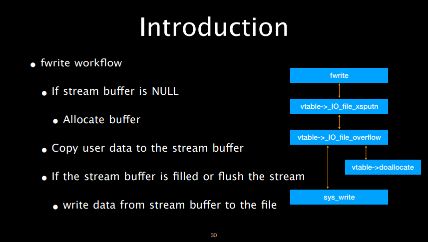

fwrite is very similar to fread, but the function is opposite to each other. It also allocated a stream buffer if it is NULL at first. Then copy user data to the stream buffer from source and then write data from stream buffer to the file only if the stream buffer is filled or flush the stream.

- The workflow of `fclose`:

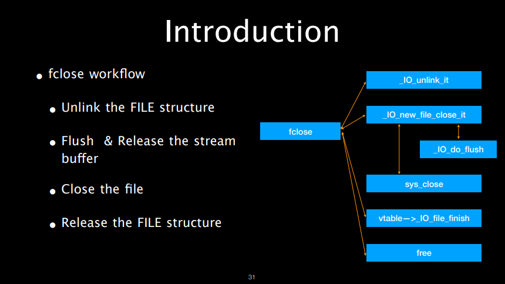

`fclose` is the opposite of fopen. It would delete the structure from the linked list of file stream at first. Then flush the stream buffer, make sure everything is written to the file. Finally, close the file and release the memory space.

# Chapter_3_Exploitation_of_FILE_structure

## 3.1_Abuse_the_FILE_structure_to_code_execution

There are many good targets in FILE structure. The best one is virtual function table. If we can control the table, the we can control the flow. We use a simple case to explain how to control the flow with FILE structure.

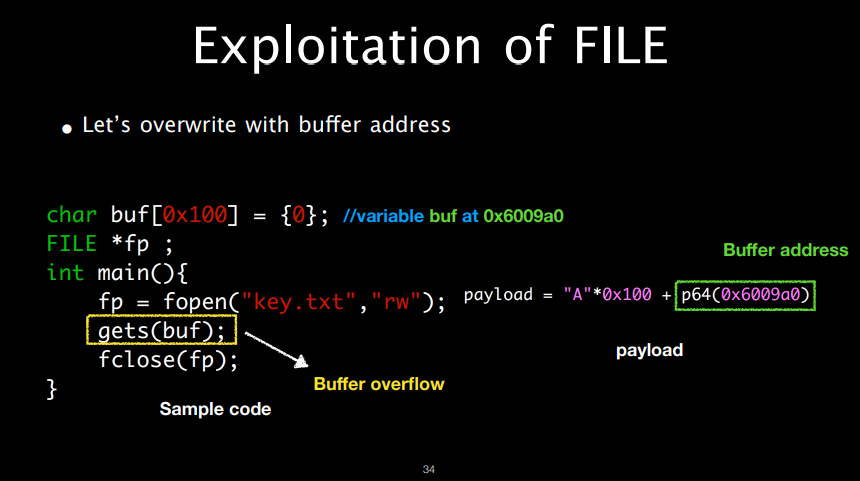

It’s a buffer overflow vulnerability in the sample code. It does not check length of user’s input so that we can overwrite the FILE pointer on the BSS section.

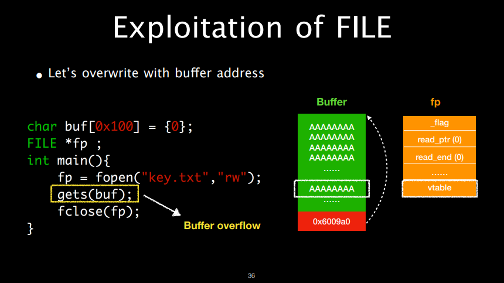

Assume the address of buffer contains our input is 0x6009a0. We overwrite the FILE pointer with buffer address. In theory, if the program executed to `fclose`, it would take the buffer as FILE pointer and we wound control instruction pointer.

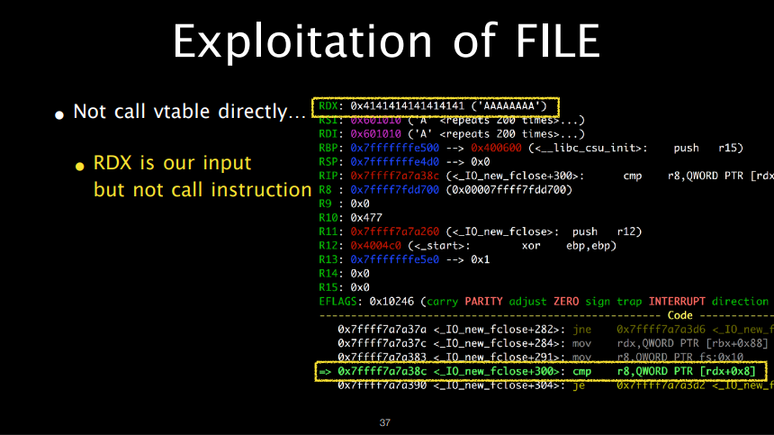

However, when we run it, we found that is does not crash at call instruction, but a compare instruction, and the crash value controllable. After debugging it with GNU C library source code to see what happened in fclose. We found a segmentation fault at `_IO_acquire_lock`. It is a lock structure pointer in the File structure which should be pointed to a writable memory and used to prevent race condition in multithread environment. As a consequence, if we want to overwrite virtual function table to gain control, we have to construct it.

We used a global buffer filled with zero and reconstructed our payload so that the lock pointer could point to the buffer.

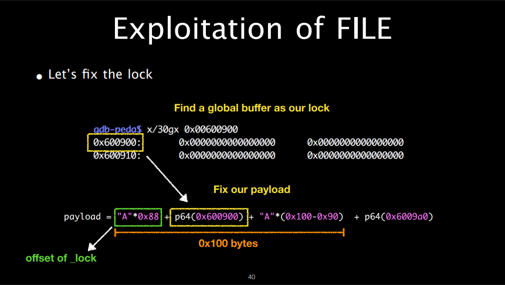

The final payload would look like the diagram above. 0x88 is offset of lock, we can use debugger or GNU C Library source code to get the value. After do that, the program would crash at instruction of call and the value of register is our input. That is, we control the program counter.

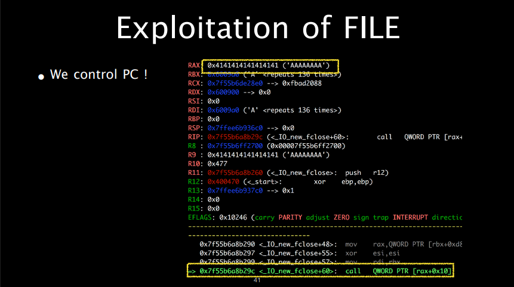

Another interesting, stdin, stdout and stderr which used in standard I/O stream related function are also a FILE structure in GNU C library. Therefore, we can overwrite the global variable in GNU C library to control the execution flow.

## 3.2_File-Stream_Oriented_Programming

File-Stream Oriented Programming called FSOP use FILE structure to do oriented programming. It similar to ROP, COP and so on. ROP drives the control flow by gadgets that all end in a return instruction. COP use call instruction. FSOP uses virtual function table with call in the FILE structure. If we want to do FSOP, we need to control the linked list of file stream and find a powerful function called `_IO_flush_all_lockp` in somewhere we can easily trigger. As a result, chain which is the next pointer in FILE structure and `_IO_list_all` which is the head of linked list, both are very important. If we can control these two pointers, then we can control the flow over and over again.

`_IO_flush_all_lockp` is used to flush all file stream in the linked list at the end of program or the program terminates.

For example, it will be called when GNU C library aborts, exits and executes “main return”. The goal of `_IO_flush_all_lockp` is to prevent all data from being written to the file when the program ends. In this paper, we will take abort routine as our example.

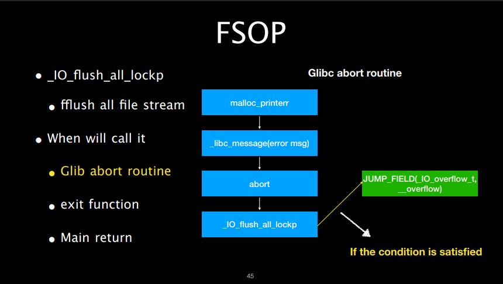

When the GNU C library detects some memory corruption problem, it would enter to the abort routine. In GNU C library abort routine, it would print some error messages, then check file stream if need to flush and call virtual function in the file structure. After do that, it would call exit system call to terminate the program. We simplified the source code of `_IO_flush_all_lockp`.

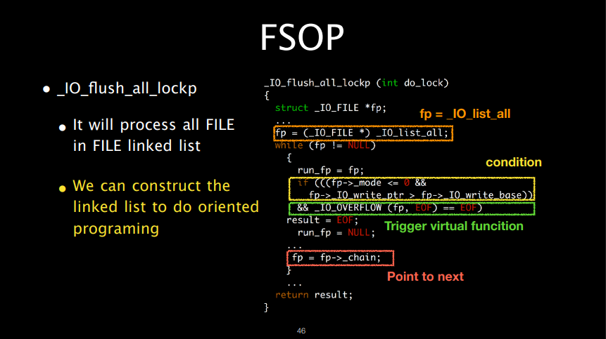

We can see the iterator fp is assigned `_IO_list_all` which the head of linked list of FILE structure. The condition is to check the FILE stream if need to flush. If the condition is satisfied, it would call function in the virtual funcrtion table. Then assigned fp to next file structure in the linked list. It would repeat until next pointer is NULL. Therefore, if we can overwrite the `_IO_list_all` with our buffer which we can control and trigger abort routine, we can control the flow again and again.

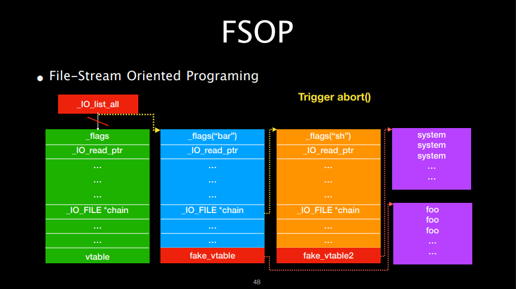

For example, if we used some memory corruption vulnerability to overwrite `_IO_list_all` and construct the linked list as shown in the diagram and then trigger about routine. If the condition in `_IO_flush_all_lockp` is satisfied, it would call “foo” function in our fake virtual function table and the parameter of the function is `this` pointer which points to itself. It is very same as virtual function call in C++. After call the virtual function in the first FILE structure, the control flow would drive to process next FILE stream and call next virtual function if the condition is satisfied.

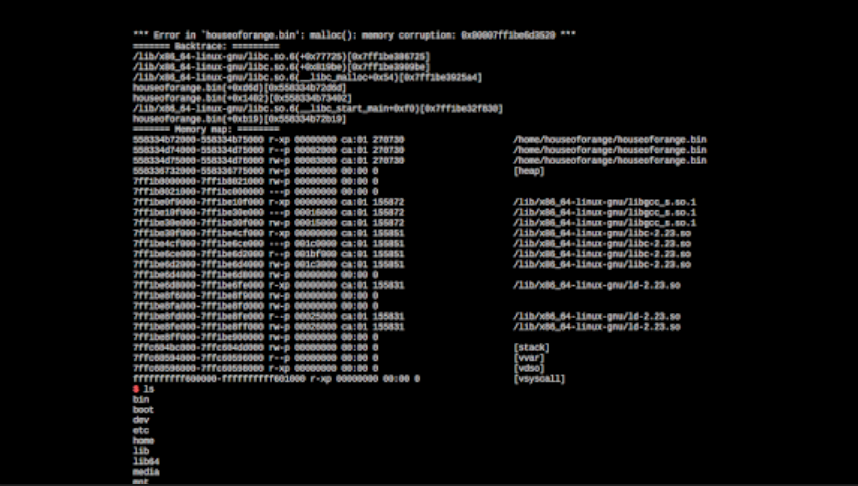

The result would look like the screen shot shown here, we get the abort message as well as a shell.

## 3.3_Vtable_verification_in_FILE_structure

Unfortunately, because more and more attacks use virtual function table to control the flow, there is a protection added to virtual function table in latest GNU C library since version 2.24 (release at 2017). It would check the address of virtual function before virtual function call. If the virtual function is invalid, it would terminate directly.

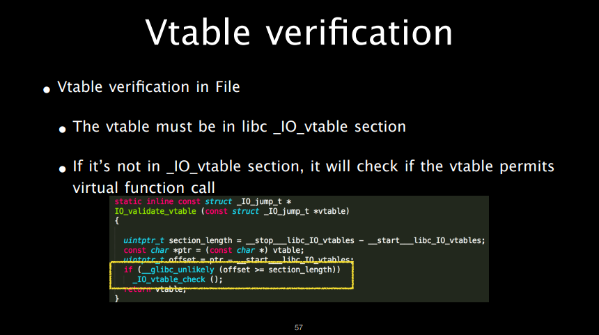

In the source code of vtable verification, it would validate if the virtual function table is in `_IO_vtable section`. If it’s not, it would check if the virtual function table permits virtual function call.

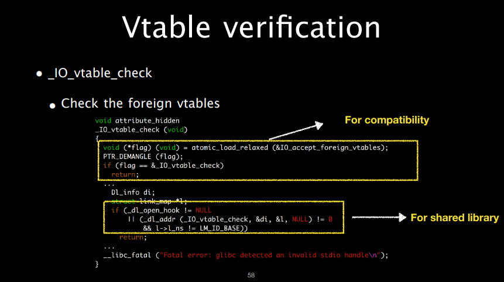

There are two checks, the first one is to check if it is for compatibility. In case this libc copy is in a non-default namespace, we always need to accept foreign vtables because there is always a possibility that FILE * objects are passed across the linking boundary. The second one is to check if it’s for shared library from `dl_open`.

It’s is very hard to bypass this two check. For the first one, it has a pointer guard. Pointer guard is very similar to stack guard that is generated at the beginning of the program and we cannot predict it. It would exclusive OR with pointer when we want to use it. For the second one, if we can control `dl_open_hook`, then we can bypass it. But if you can control the value, you can also control other good target such as `malloc_hook` in GNU C library.

Accordingly, directly bypass the vtable verification is very hard.

## 3.4_Make_FILE_Structure_great_again

Because directly control virtual function table is difficult. We can change the target from virtual function table to other elements. After reading source in GNU C library, we found if we can overwrite FILE structure and use fread, fwrite or other stream related function with FILE structure, we can do arbitrary memory reading or arbitrary memory write. To simplify the workflow, we will use fread and fwrite as our example. In fact, other stream related function can also do it.

### 3.4.1_Arbitrary_memory_reading

`fwrite`: Under normal usage, fwirte is used to write data to file. Our goal is to write data in memory to `stdout`. If we want to do that, we must meet these conditions below.

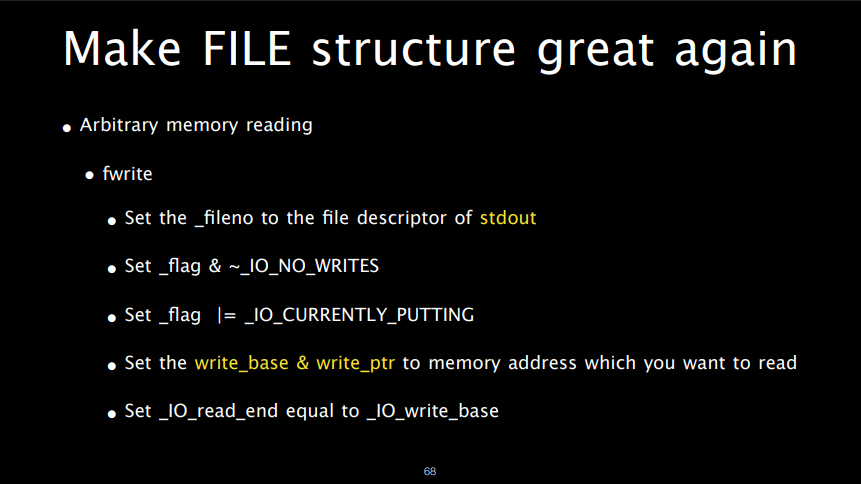

1. Set the `_fileno to the file descriptor of stdout`
	In our case, we want to show in stdout so we use stdout as our output. It also can be set to socket.

2. Set `_flag &~ _IO_NO_WRITE`
	In the `_flag` value, we want to write so we must not need NO Write flag.

3.  Set `_flag |= _IO_CURRENTY_PUTTING`
	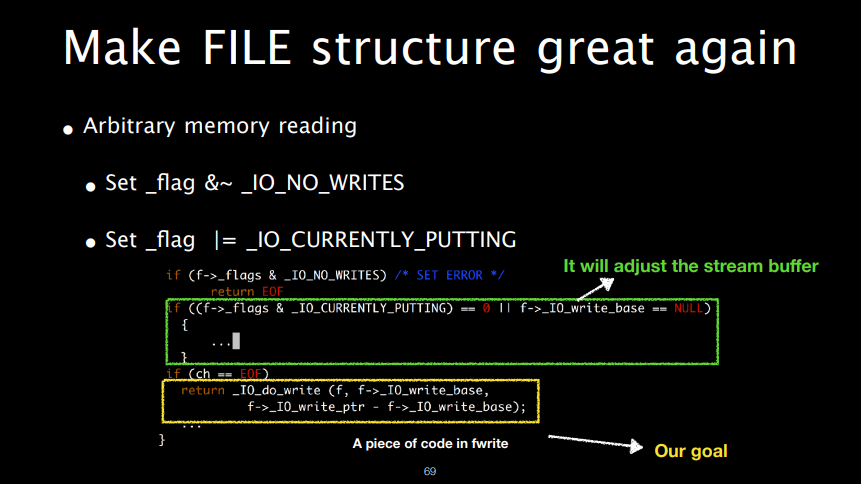

	In the source code of fwrite internal, we can see whether we cannot set `_IO_CURRENTLY_PUTTING`, it would adjust the stream buffer pointer and it would affect the results we want. Then it would call `_IO_do_write`. But it just calls virtual function but not call system call write directly.

4. Set `_IO_write_base` and `_IO_write_ptr` to memory address which you want to read.
	GNU C library would take the buffer as stream buffer.

5. Let `_IO_read_end` equal to `_IO_write_base`
	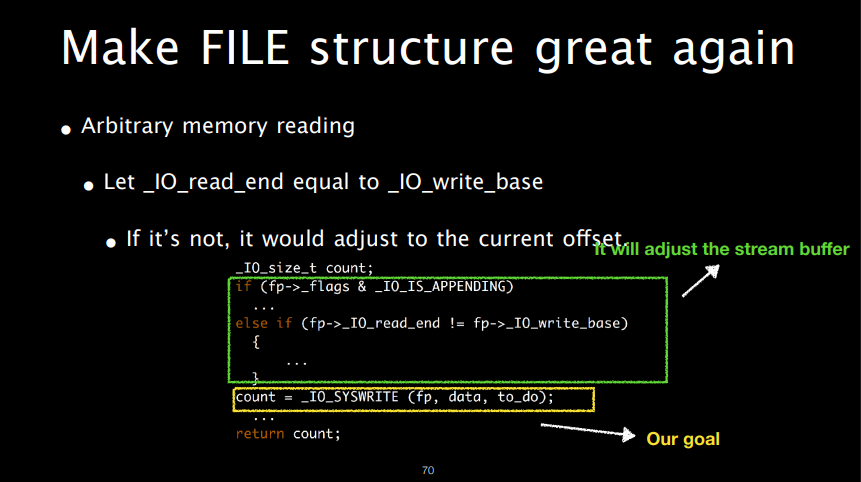
	
	We can see that we must set `_IO_read_end` equal to `_IO_write_base`. Otherwise, it would also adjust the stream buffer and affect our result we want.

This is a sample code to verify it. If we do nothing on FILE, it’s just a program that write data your input to file

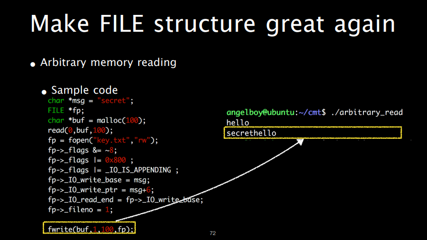

After modify value of element in the file structure, you can see that it reads your input and then writes some data called secret in the memory. Just like the picture below, our input is hello, but the final result was printed out with “secret”. That is, We can write any data in the memory. In other word, if we can control all data in file structure, we can use it to bypass ASLR.

### 3.4.2_Arbitrary_memory_writing

`fread`: It is very similar to fwrite. We also need to meet these conditions above.

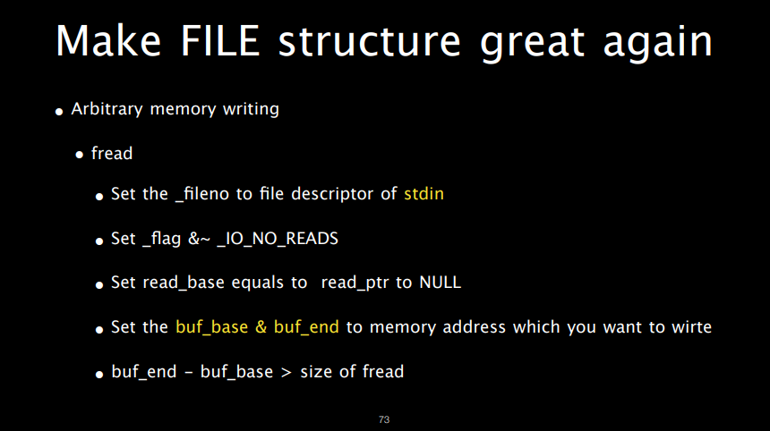

1. Set the `_fileno to file descriptor of stdin`
	In our case, we want to read from stdin so we change it to file descriptor to stdin. It also can replace with socket if you want to read from socket.

2. Set `_flag &~ _IO_NO_READS`
	We do not need the flag `_IO_NO_READS`. Because we want to use read to write data to memory.

3. Set `_IO_read_base` equal to `_IO_read_ptr`
	If we not set it, the GNU C library would think that there is still data in your buffer that must be written first. And we can’t write our data to destination.
	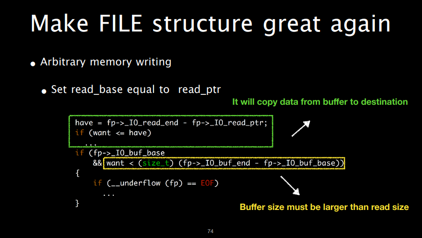

4. Set the `_IO_buf_base` and `_IO_buf_end` to memory address which you want to write and the size of buffer (`_IO_buf_end - _IO_buf_base`) must be larger than size of fread.
	Because you need to let it think that buffer has enough space to put you data.

We also use a sample code to verify it. If we do nothing on file, it just reads data from file and put an empty buffer called `msg`.

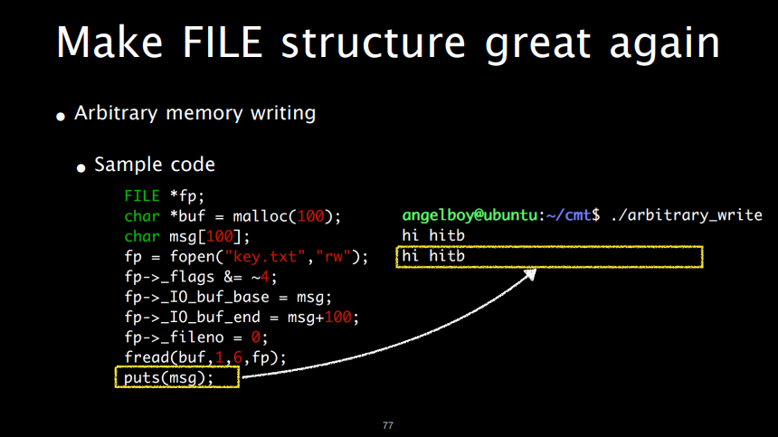

After modify value of element and set msg as our stream buffer in the file structure. If you execute it, you can find that it’s waiting for your input. That is, fread is reading from stdin but not from file. And then after input some strings like the screen shot below, it prints out your input but not empty string. In other word, we can do arbitrary memory writing.

### 3.4.3_Control_the_world

After you can do arbitrary memory reading or writing , you can control the flow easily. You can overwrite some variables contain function pointer. For instance, you can write `global offset table` or `hook` series. By the way, you can not only use fread and fwrite but also use any I/O related functions which use FILE structure such as fget, fput and so on.

### 3.4.4_No_File_operation_case

What if there is no any file operation in the program? Actually, we can use stdin, stdout and stderr with virtual function table protection as our target.

This is very common use of standard IO related function such as put, printf or scanf in a program. It would use stdin, stdout or stdin in GNU C library. We take two scenarios to show how to use stdin and stdout to exploit a process.

- <mark>Information leak</mark>

The first one, assume we have some memory corruption on the heap and use any stdout related function in the program. How can we do to bypass ASLR in full protection?

We can use some heap exploit technique to overwrite `_flag` and partial overwrite `_IO_write_base`. For example, we can use fastbin attack to partially overwrite unsorted bin if we don’t have any address, it would allocate a chunk on stdout so that we can overwrite it. It is very similar to [`house of Roman`](https://gist.github.com/romanking98/9aab2804832c0fb46615f025e8ffb0bc), but our target is file structure.

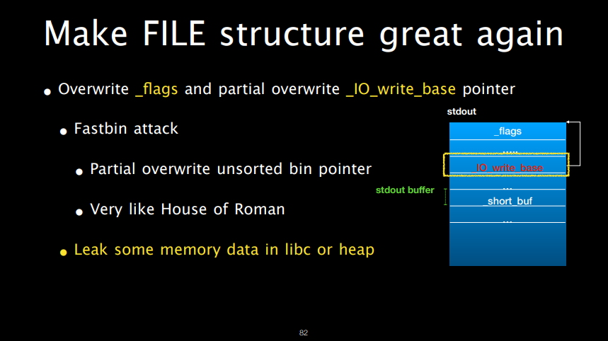

After do that, if we call some stdout related function. It would print some memory data in glibc or heap. Because `_IO_write_base` have been changed to the front of the stdout and It will print the content of stdout. There are many interesting values which contain some glibc addresses and heap addresses in stdout. Therefore, we can use the technique to bypass ASLR again.

- <mark>Code execution</mark>

The second one is code execution. Assume, there are some stdin related functions in the program such as `scanf`, `fgets` and so on. Besides, stdin is unbuffered. That will make the stdin function look like no stream buffer. But in facts it has a one-byte buffer called short buffer in the stdin structure internal at first. `_IO_buf_base` and `_IO_buf_end` is point to it. If we have some memory corruption on heap, we can use unsorted bin attack which is very common in heap exploitation to overwrite `_IO_buf_end` with a point. The point called unsorted bin is behind the stdin structure. As a result, we create a large stdin buffer in the glibc again.

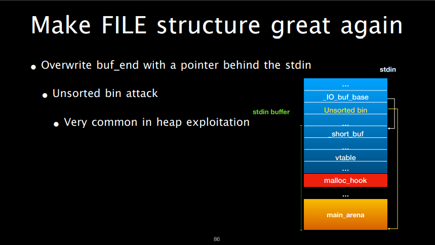

As a result, we create a large `stdin buffer` in the glibc again. Therefore, it would use the large buffer as stream buffer while we call some stdin related function. For instance, if we call `scanf(“%d”)`, it will call `read(0,buf_base,size of stdin buff)`. That is, it can overwrite many global variables in glibc such as `malloc_hook`. Finally, if you trigger malloc later, you can control the flow again!

### 3.4.5_Another_bypass_method

There are some another bypass verification. If the virtual function use `_IO_strfile` structure, it would invoke another virtual function table without virtual function table verification so we can use this function and forge another virtual function table, we can control program counter again.
[`_IO_str_jumps`](https://dhavalkapil.com/blogs/FILE-Structure-Exploitation/)
[`_IO_wstr_finish`](https://tradahacking.vn/hitcon-2017-ghost-in-the-heap-writeup-ee6384cd0b7)

### 3.4.6_Another_platform

How about Windows? File structure does not have any virtual function table on Windows. But it also has stream buffer pointer. So, we can corrupt it to achieve arbitrary memory reading and writing.

# Chapter_4_Conclusion

File structure is a good target for binary exploitation. We show that it can be used to arbitrary memory read and write, control the PC and do oriented programming. But I think that it can be used to another exploit technology such as arbitrary free or unmap. It’s also very powerful in some unexploitable case.
