# Dive into FSOP (P1)
FSOP là tên viết tắt của File Stream Oriented Programming. Kĩ thuật này có thể dẫn đến arbitrary read/write hoặc thậm chí là RCE thông qua việc lợi dụng cấu trúc luồng tệp GLIBC để thực thi mã do memory corruption. 
Các mục tiêu phổ biến nhất của FSOP là `stdin`, `stdout` và `stderr` vì chúng được hầu hết các chương trình sử dụng. Bên cạnh đó, kĩ thuật này vẫn có thể được sử dụng trên các files hoặc socket, miễn là chúng được "wrap" trong một stream (vd: sử dụng `fopen` thay vì `open` chẳng hạn)

Kĩ thuật này đã trở nên rất phổ biến kể từ khi các con trỏ `__malloc_hook`, `__free_hook` và tất cả các con trỏ khác đã bị xóa khỏi GLIBC trong phiên bản 2.34.

Tuy đã đọc khá nhiều writeups về chủ đề này nhưng bản thân mình vẫn còn cảm thấy khá mơ hồ. Hơn nữa đây vẫn là một kĩ thuật rất mạnh, có thể sử dụng trong các libc hiện đại. Do vậy mình quyết định viết một bài tổng hợp về kĩ thuật này để chuẩn bị cho các CTF challenge khác trong tương lai.

## I. File operator in C
Mình sẽ bắt đầu phần này với một số khái niệm đơn giản. Trong đó giải thích về stream và FILE structure trong libc.

### 1. File stream. Phân biệt os syscall và FILE stream

Streams xuất hiện vì tất cả các chương trình đều cần tương tác với môi trường xung quanh dưới nhiều hình thức khác nhau (có thể là các tệp tin, thiết bị I/O như màn hình và bàn phím, hoặc có thể là các socket mạng, v.v.).
Vì vậy, stream là interface để khởi tạo luồng dữ liệu I/O tới bất cứ thứ gì có thể là nguồn cung cấp hoặc đích đến của dữ liệu I/O đó. 

Ở đây mình sẽ trích 1 đoạn thấy khá hay ở stack overflow:

> `📖` So for instance, thinking about the way our program can get input from the keyboard..., how does that happen? That happens through a hidden stream that the OS provides for every "process", and the OS gives the address to the standard stream made for a process to it automatically(i.e., we won't need to write code to locate its address). This stream is commonly called the "stdin"(rooted in the C & Unix terminology), or more formally called "The Standard Input Stream". Our programs, no matter written in what language, must be able to use such standard streams made by the OS through the standard I/O libraries of that language. As an example, in the C programming language, we may scan the standard input stream by calling the function "scanf"(scanf will know where the stdin of our program is automatically).
> 
> But as another important example, again in C, let's say this time our program wants to write user's input to a "file"... Does only the existence of the stdin stream suffice in this situation? Of course not! This time, we'll need to use a pair of streams, one already provided by the OS, the stdin, to get the user's input, and a second one, to let the communication between our program and the file! So we will have to create this second stream! Something which can be done by calling the fopen() function. (Fun Fact: In the manual, if you notice, you will see that the returned type of this function is a pointer to a structure called FILE, but that’s only a traditional “bad choice of word” for what's actually a pointer to a "stream"! Yes, the type FILE in C is indeed a stream, and not a file!(I see, crazy!) So remember, the pointer FILE* does NOT point to the actual file, it points to a stream containing the information about that file, including information about the buffer used for the file's I/O and etc.)
>
> 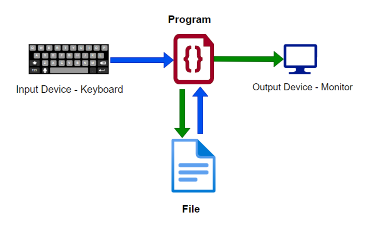

Như đã nói bên trên, `FILE` là một File stream descriptor. Cấu trúc `FILE` được tạo khi chương trình thực thi các hàm như `fopen` và được phân bổ trong heap.
Khi người dùng gọi `read/write` với 1 file, kernel không read hoặc write từ file directory. Thay vào đó, kernel read data từ file vào `Kernel buffer`, data này sau đó sẽ được copy đến một nơi mà người dùng muốn read hoặc write. Mục đích của điều này là giảm số lần ghi vào ổ cứng, nhằm tăng hiệu năng của chương trình.

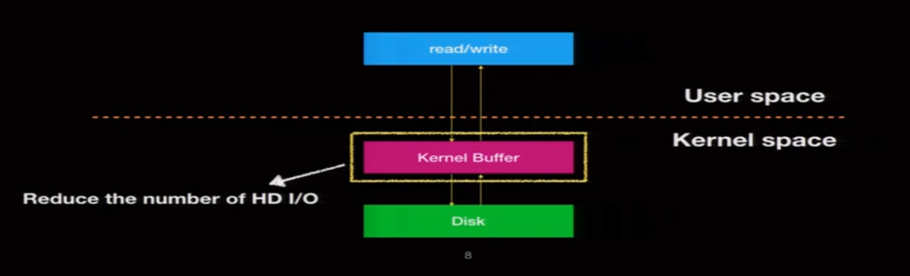

Ở userspace, khi ta sử dụng `fread` hoặc `fwrite` để đọc file, `buffer` sẽ được khởi tạo ở userspace. Sau đó data sẽ được đọc từ kernel buffer vào stream buffer. 
Again, chỗ này có tác dụng giảm số lượng syscall cần gọi. Từ đó cũng làm tăng hiệu năng của chương trình.

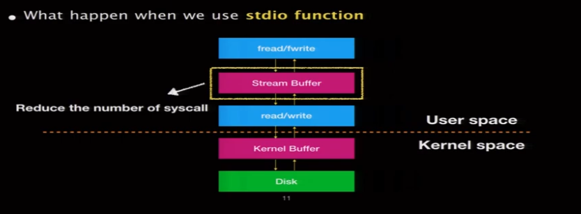

Lại đi trích một đoạn nữa ở stack overflow, ví dụ về sự khác nhau giữa `open()` và `fopen()`
> `open()` is a low-level os call. 
> `fdopen()` converts an os-level file descriptor to the higher-level FILE-abstraction of the C language. 
> `fopen()` calls `open()` in the background and gives you a FILE-pointer directly.
>
> 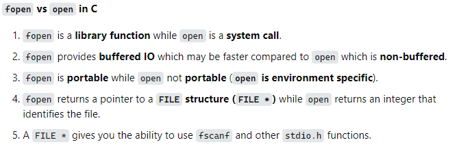


### 2. FILE structure
Ở phần này mình sẽ bắt chước idol `kyr04i`, sử dụng `GLIBC-2.35` để tìm hiểu một số struct bên trong Glibc code.

##### 2.1. Bắt đầu với FILE struct...
Kiểu dữ liệu `FILE` thực ra là một `_IO_FILE` struct
```c
typedef struct _IO_FILE FILE
```
mà cụ thể hơn
```c
/* The tag name of this struct is _IO_FILE to preserve historic
   C++ mangled names for functions taking FILE* arguments.
   That name should not be used in new code.  */
struct _IO_FILE
{
  int _flags;		/* High-order word is _IO_MAGIC; rest is flags. */

  /* The following pointers correspond to the C++ streambuf protocol. */
  char *_IO_read_ptr;	/* Current read pointer */
  char *_IO_read_end;	/* End of get area. */
  char *_IO_read_base;	/* Start of putback+get area. */
  char *_IO_write_base;	/* Start of put area. */
  char *_IO_write_ptr;	/* Current put pointer. */
  char *_IO_write_end;	/* End of put area. */
  char *_IO_buf_base;	/* Start of reserve area. */
  char *_IO_buf_end;	/* End of reserve area. */

  /* The following fields are used to support backing up and undo. */
  char *_IO_save_base; /* Pointer to start of non-current get area. */
  char *_IO_backup_base;  /* Pointer to first valid character of backup area */
  char *_IO_save_end; /* Pointer to end of non-current get area. */

  struct _IO_marker *_markers;

  struct _IO_FILE *_chain;

  int _fileno;
  int _flags2;
  __off_t _old_offset; /* This used to be _offset but it's too small.  */

  /* 1+column number of pbase(); 0 is unknown. */
  unsigned short _cur_column;
  signed char _vtable_offset;
  char _shortbuf[1];

  _IO_lock_t *_lock;
#ifdef _IO_USE_OLD_IO_FILE
};

struct _IO_FILE_complete
{
  struct _IO_FILE _file;
#endif
  __off64_t _offset;
  /* Wide character stream stuff.  */
  struct _IO_codecvt *_codecvt;
  struct _IO_wide_data *_wide_data;
  struct _IO_FILE *_freeres_list;
  void *_freeres_buf;
  size_t __pad5;
  int _mode;
  /* Make sure we don't get into trouble again.  */
  char _unused2[15 * sizeof (int) - 4 * sizeof (void *) - sizeof (size_t)];
};
```

Đây là cấu trúc sơ bộ về cách mà `FILE` được triển khai. Hiện tại, mình sẽ tạm thời bỏ qua cách sử dụng của một số trường. Mình sẽ quay lại phần này khi nói về các kịch bản tấn công thông qua cấu trúc `FILE`.

##### 2.2. `_IO_list_all`
Như đã nói ở phần giới thiệu, có 3 `FILE` cơ bản thường được khai báo trong chương trình(nằm trên binary và trỏ đến các structure trong libc): `_IO_2_1_stderr`, `_IO_2_1_stdout`, `_IO_2_1_stdin`.

> `📝` `stdout` có thể ở chế độ unbuffered, line-buffered, hoặc fully-buffered. Trong đó:
> - Unbuffered - Chương trình sẽ in ra thiết bị xuất chuẩn càng sớm càng tốt (không hạn chế).
> - Line-buffered - Chương trình sẽ in ra thiết bị xuất chuẩn khi gặp kí tự new-line.
> - Fully-buffered - Chương trình sẽ in ra thiết bị xuất chuẩn khi `stdout buffers` đầy

Glibc mặc định biến `_IO_list_all` chứa 1 linked list tất cả các type FILE trong binary. Mặc định `_IO_list_all` sẽ trỏ tới `stderr` đầu tiên. Các phần tử tiếp theo sẽ được truy cập qua thuộc tính `_chain` .

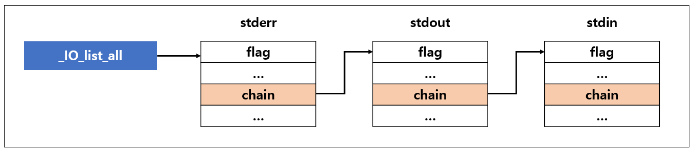

```c
struct _IO_FILE_plus *_IO_list_all = &_IO_2_1_stderr_;
```

##### 2.3. `IO_FILE_plus`

`GLIBC` cũng có một phiên bản mở rộng của cấu trúc `_IO_FILE` gọi là `_IO_FILE_plus`, được tạo thành từ `_IO_FILE` + `vtable`. Mọi `FILE` đều dùng chung một `vtable`

> (vtable = virtual table = array of pointers to the helper functions during executing the IO operation)


```c
/* We always allocate an extra word following an _IO_FILE.
   This contains a pointer to the function jump table used.
   This is for compatibility with C++ streambuf; the word can
   be used to smash to a pointer to a virtual function table. */

struct _IO_FILE_plus
{
  FILE file;
  const struct _IO_jump_t *vtable;
};
```


Các filestream mặc định như là `stdin`, `stdout`, `stderr` đều sử dụng `IO_FILE_plus` thay vì `_IO_FILE`. Mà thật ra nếu bạn mở một file với `fopen` thì cũng đều sử dụng `IO_FILE_plus` cả.
Mục đích của việc sử dụng `IO_FILE_plus` là làm cho các IO operation nhanh hơn nữa bằng cách sử dụng thêm `vtable`. Kiểu dữ liệu của `vtable` là `_IO_jump_t`.

```c
struct _IO_jump_t
{
    JUMP_FIELD(size_t, __dummy);
    JUMP_FIELD(size_t, __dummy2);
    JUMP_FIELD(_IO_finish_t, __finish);
    JUMP_FIELD(_IO_overflow_t, __overflow);
    JUMP_FIELD(_IO_underflow_t, __underflow);
    JUMP_FIELD(_IO_underflow_t, __uflow);
    JUMP_FIELD(_IO_pbackfail_t, __pbackfail);
    /* showmany */
    JUMP_FIELD(_IO_xsputn_t, __xsputn);
    JUMP_FIELD(_IO_xsgetn_t, __xsgetn);
    JUMP_FIELD(_IO_seekoff_t, __seekoff);
    JUMP_FIELD(_IO_seekpos_t, __seekpos);
    JUMP_FIELD(_IO_setbuf_t, __setbuf);
    JUMP_FIELD(_IO_sync_t, __sync);
    JUMP_FIELD(_IO_doallocate_t, __doallocate);
    JUMP_FIELD(_IO_read_t, __read);
    JUMP_FIELD(_IO_write_t, __write);
    JUMP_FIELD(_IO_seek_t, __seek);
    JUMP_FIELD(_IO_close_t, __close);
    JUMP_FIELD(_IO_stat_t, __stat);
    JUMP_FIELD(_IO_showmanyc_t, __showmanyc);
    JUMP_FIELD(_IO_imbue_t, __imbue);
};
```

Struct này chứa các con trỏ đến các phương thức IO cần thiết trong quá trình xử lí file. 
Ví dụ khi thực hiện mở 1 file thông qua `fopen()`, hệ điều hành sẽ làm các việc:
- Malloc FILE structure
- Gán vtable vào FILE structure 
- Khởi tạo FILE structure
- Liên kết FILE structure vào `_IO_list_all`
- Call fopen()

Trong quá trình trên, bước **gán vtable vào FILE structure** là một bước quan trọng mà ta có thể tận dụng được. Mình sẽ đi sâu hơn vào bước này.
Nhìn vào source code của [fopen](https://elixir.bootlin.com/glibc/glibc-2.24/source/libio/iofopen.c#L60), ta thấy `vtable` được khởi tạo với một `vtable` đã tồn tại có tên là `IO_file_jumps`. 

```c
#define _IO_JUMPS(THIS) (THIS)->vtable
...
_IO_FILE *__fopen_internal (const char *filename, const char *mode, int is32)
{
...
  _IO_JUMPS (&new_f->fp) = &_IO_file_jumps;
...
}
```

**Một điều đáng chú ý nữa là**: Khi thực hiện `_IO_FINISH(FP)`, nó sẽ gọi đến hàm được lưu trong vtable của FILE được truyền vào, với chỉ mục kiểu int là vị trí của hàm `_IO_finish_t` trong bảng `vtable`.
```c
# define _IO_JUMPS_FUNC(THIS) (IO_validate_vtable (_IO_JUMPS_FILE_plus (THIS)))
...
...
#define JUMP1(FUNC, THIS, X1) (_IO_JUMPS_FUNC(THIS)->FUNC) (THIS, X1)
...
...
/* The 'finish' function does any final cleaning up of an _IO_FILE object.
   It does not delete (free) it, but does everything else to finalize it.
   It matches the streambuf::~streambuf virtual destructor.  */
typedef void (*_IO_finish_t) (_IO_FILE *, int); /* finalize */
#define _IO_FINISH(FP) JUMP1 (__finish, FP, 0)
```

> For example, if it calls `_IO_FINISH(FP)`, that means it will call the stored function pointer of the passed FILE variable, specifically `FP.vtable[idx]` entry (`idx` is the index of `__finish` and vtable is the `_IO_file_jumps` in this case).

Tóm gọn lại, nếu chúng ta có thể ghi đè 1 file structure nào đó, thì ta có thể điều khiển được nơi mà chúng ta có thể biến `write, read -> READ/WRITE PRIMITIVE` . Tuy nhiên để đạt được điều này chúng ta cần chú ý các điều kiện(sẽ nói ở phần tấn công).

##### 2.4. The usage of vtable in a FILE structure
Mình sẽ chọn ví dụ về hàm `exit`, một phần là bắt chước blog của anh `Chovid99`, một phần nữa là gần đây mình vừa phải chui vào đọc src hàm này khá nhiều do làm challenge  [printable](https://pwnable.tw/challenge/#36) trên pwnable.tw, chưa dám nói là nắm rõ nhưng cũng tạm gọi là quen nhau :).

```c
#include <stdio.h>
#include <stdlib.h>

int main() {
    exit(1337);
}
```

Để nói nhanh thì hàm `exit` sẽ gọi đến `_IO_cleanup`(tuy nhiên là chỉ khi debug bằng gdb mới thấy điều này), do đó nên cũng cần đến sự tham gia của các IO operation.

```c
int
_IO_cleanup (void)
{
  /* We do *not* want locking.  Some threads might use streams but
     that is their problem, we flush them underneath them.  */
  int result = _IO_flush_all_lockp (0);

  /* We currently don't have a reliable mechanism for making sure that
     C++ static destructors are executed in the correct order.
     So it is possible that other static destructors might want to
     write to cout - and they're supposed to be able to do so.

     The following will make the standard streambufs be unbuffered,
     which forces any output from late destructors to be written out. */
  _IO_unbuffer_all ();

  return result;
}
```

Ta thấy `_IO_cleanup` lại gọi đến `_IO_flush_all_lockp`

```c
int
_IO_flush_all_lockp (int do_lock)
{
...
  last_stamp = _IO_list_all_stamp;
  fp = (_IO_FILE *) _IO_list_all;
  while (fp != NULL)
    {
      run_fp = fp;
      if (do_lock)
	_IO_flockfile (fp);

      if (((fp->_mode <= 0 && fp->_IO_write_ptr > fp->_IO_write_base)
#if defined _LIBC || defined _GLIBCPP_USE_WCHAR_T
	   || (_IO_vtable_offset (fp) == 0
	       && fp->_mode > 0 && (fp->_wide_data->_IO_write_ptr
				    > fp->_wide_data->_IO_write_base))
#endif
	   )
	  && _IO_OVERFLOW (fp, EOF) == EOF)
	result = EOF;

      if (do_lock)
	_IO_funlockfile (fp);
      run_fp = NULL;

      if (last_stamp != _IO_list_all_stamp)
	{
	  /* Something was added to the list.  Start all over again.  */
	  fp = (_IO_FILE *) _IO_list_all;
	  last_stamp = _IO_list_all_stamp;
	}
      else
	fp = fp->_chain;
    }
...
}
```

`_IO_flush_all_lockp` sẽ duyệt qua tất cả các `FILE` có sẵn (thông qua việc sử dụng `_IO_list_all` đã nói bên trên).
Nếu một số điều kiện nhất định được đáp ứng thì nó sẽ gọi đến `_IO_OVERFLOW (fp, EOF)`.
Mà `_IO_OVERFLOW (fp, EOF)` sẽ thực hiện lời gọi hàm tới con trỏ được lưu bên trong `fp.vtable[__overflow]`.

> Vậy thì bài `printable` dùng fsop có lẽ sẽ dễ dàng hơn. Suyyyyy nhè nhẹ :(

Thêm một ý nho nhỏ nữa là `_IO_cleanup` cũng gọi đến `_IO_unbuffer_all`, trong đó thì `vtable` cũng lại được gọi tên.
```c
static void
_IO_unbuffer_all (void)
{
    ...
    _IO_SETBUF (fp, NULL, 0);
    ...
}
```

Để kết thúc phần này, mình sẽ nói qua về một số attack scenario, lấy luôn trường hợp cụ thể là khi gọi hàm `exit`.
- Hijack the vtable of the IO file (For example, stdout).
  - Như đã nói bên trên, khi chúng ta gọi `exit` trong ví dụ trên, nó sẽ duyệt qua danh sách liên kết FILE và nếu một số ràng buộc được đáp ứng, nó sẽ gọi `fp.vtable[__overflow]`.
  - Nếu chúng ta có thể hijack `vtable` entry của `__overflow`, chẳng hạn với địa chỉ hàm `system`, thì khi `exit()` được gọi, thay vì thoát khỏi chương trình thì ta sẽ có RCE. Một số cách để hijack là:
    - Tạo **fake vtable**, ghi đè địa chỉ của **fake vtable** vào bên trong IO file. Như vậy khi IO operation gọi `__overflow` thì sẽ gọi đến hàm chúng ta muốn.
    - Ghi đè con trỏ vtable sang vtable khác có sẵn
    - Misaligned vtable, chẳng hạn như khi IO operation gọi `__finish` thì lại gọi `__overflow`.
- Forge a fake FILE structure with a fake vtable, and then somehow try to trigger `_IO_flush_all_lockp`
  -  `_IO_flush_all_lockp` sẽ duyệt qua từng FILE có sẵn trong danh sách được liên kết, vì vậy nếu chúng ta có thể tạo fake FILE struct và trigger flush, điều đó có nghĩa là nó sẽ sử dụng `vtable` giả của chúng ta, điều này cũng sẽ cho phép chúng ta có RCE.
- Use the FILE buffer metadata so that we can do write operation in our desired target address (Arbitrary Address Write).

Chi tiết về cách thực hiện các cuộc tấn công này sẽ được nói tới ở phần sau.

## II. FSOP attack
### 1. Arbitrary write
Setup: 


Xét chương trình sau:
```C
#include <stdio.h>
#include <stdlib.h>
#include <string.h>

int main() {
    FILE *fp;
    char *buf = malloc(100);
    char msg[100];
    
    memset(msg, 0, 100);  
    fp = fopen("key.txt", "rw");
    fread(buf, 1, 6, fp);  
    puts(msg); 

    return 0;
}
```

Do `msg` đã được memset về 0 nên khi chạy chương trình sẽ không in ra cái gì cả.
```bash
grass@grass:/mnt/d/Blog/Docs/FSOP$ ./arbitrary_write

grass@grass:/mnt/d/Blog/Docs/FSOP$
```
Sử dụng gdb để debug chương trình. 
Ta thấy trước khi gọi `fopen` thì `_IO_list_all` đang trỏ đến `_IO_2_1_stderr_`


Sau khi gọi fopen, một FILE mới được đưa vào bên trong linked list.


Ta thấy fread sử dụng `FILE` này.

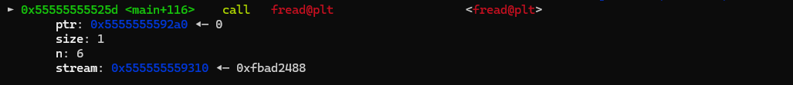
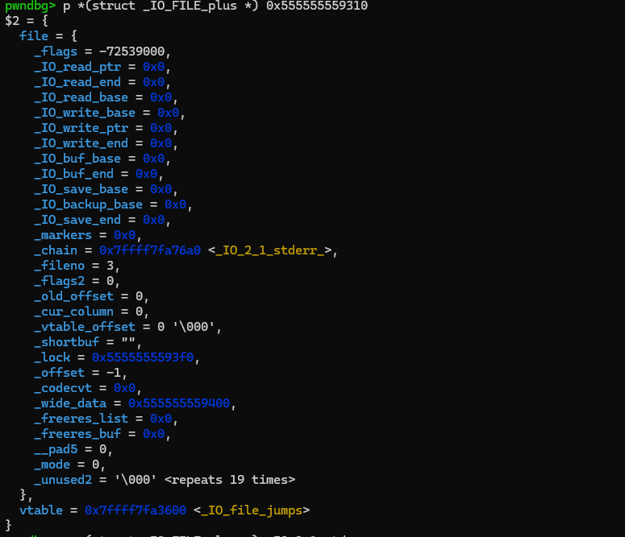

Bây giờ chúng ta sẽ thay đổi một số trường trong cấu trúc FILE để có thể ghi vào bên trong biến `msg`.


Trong đó:
- `_flags` được set là `0xfbad2488` (ta có thể tính được giá trị này thông qua việc đọc source code libc, nhưng tạm thời ở phần này thì cứ áp dụng công thức bên trên đã)
- `_IO_buf_base` là địa chỉ của `msg` bên trong stack.
- `_IO_buf_end` là địa chỉ của `msg+100`.
- `_fileno` được set về 0.

Chạy tiếp chương trình, ta thấy lúc này chương trình cho phép ta nhập vào 2 lần. Lần nhập thứ 2 chính là nhập vào địa chỉ của msg. Kết quả: 

```bash
grass@grass:/mnt/d/Blog/Docs/FSOP$ ./arbitrary_write
44
55
55

```

### 2. Arbitrary read 

Setup: 


Ta sẽ dùng chương trình sau để làm ví dụ:
```C
#include <stdio.h>
#include <fcntl.h>

int main() {
    char *msg = "secret";
    FILE *fp;
    char *buf = malloc(100);
    read(0, buf, 100);
    fp = fopen("key.txt", "w+");
    fwrite(buf, 1, 100, fp);
}
```

Đây là một chương trình ghi vào file `key.txt`.
```bash
grass@grass:/mnt/d/Blog/Docs/FSOP$ ./arbitrary_read
aaaaa
grass@grass:/mnt/d/Blog/Docs/FSOP$ ./arbitrary_read
5555
grass@grass:/mnt/d/Blog/Docs/FSOP$ cat key.txt
5555
```

Mục tiêu của lần này là đọc được xâu `secret` được lưu bên trong `msg`.
Tương tự như bên trên, ta chỉ cần set các giá trị:
```c
  fp->_flags &= ~8;
  fp->_flags |= 0x800;
  fp->_flags |= __IO_IS_APPENDING;
  fp->_IO_write_base = msg;
  fp->_IO_write_ptr = msg + 6;
  fp->_IO_read_end = fp->_IO_write_base;
  fp->_fileno = 1;
```

là sẽ có thể đọc được.
```bash
grass@grass:/mnt/d/Blog/Docs/FSOP$ ./arbitrary_read
5555
secret5555
```

### 3. Giải thích
Ở phần này mình sẽ giải thích về các trường trong `FILE structure`, cũng như trả lời câu hỏi tại sao khi set các trường này thành các giá trị như bên trên thì lại có thể đạt được `arbitrary read/write`

Để làm điều này mình sẽ sử dụng ví dụ sau:
```C
#include <stdio.h>

int main(){
    puts("FSOP ATTACK");
    return 0;
}
```

**Bây giờ mình sẽ đặt breakpoint ở `puts` và chui vào bên trong xem flow của hàm này như thế nào.**

- Đầu tiên `puts` gọi đến `_IO_puts`


```C
int
_IO_puts (const char *str)
{
  int result = EOF;
  size_t len = strlen (str);
  _IO_acquire_lock (stdout);

  if ((_IO_vtable_offset (stdout) != 0
       || _IO_fwide (stdout, -1) == -1)
      && _IO_sputn (stdout, str, len) == len
      && _IO_putc_unlocked ('\n', stdout) != EOF)
    result = MIN (INT_MAX, len + 1);

  _IO_release_lock (stdout);
  return result;
}

weak_alias (_IO_puts, puts)
libc_hidden_def (_IO_puts)
```

- Tiếp đến thì `_IO_file_xsputn` được gọi đến

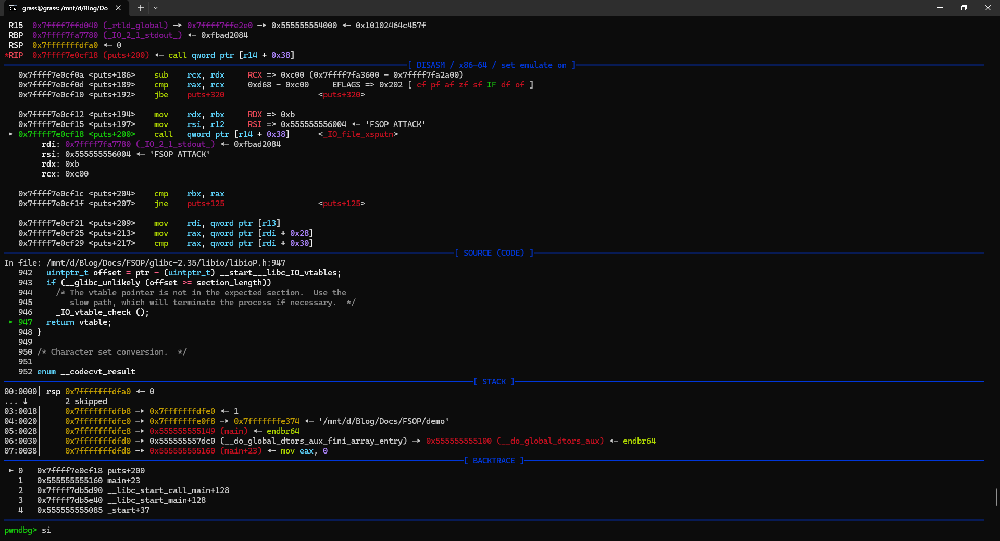

```C
#define _IO_XSPUTN(FP, DATA, N) JUMP2 (__xsputn, FP, DATA, N)
```

- Tiếp đến là [`_IO_file_overflow`](https://elixir.bootlin.com/glibc/glibc-2.35/source/libio/fileops.c#L730)

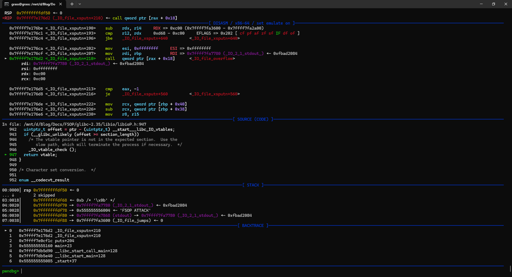

- Tiếp đến lại gọi đến [`_IO_do_write`](https://elixir.bootlin.com/glibc/glibc-2.35/source/libio/fileops.c#L422)

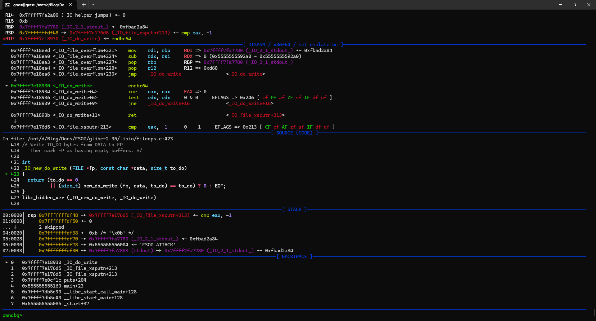

- Gọi tiếp đến `_IO_file_write` 

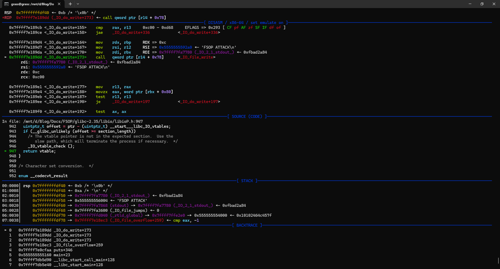

- Cuối cùng thì ta thấy syscall write được gọi để in ra chuỗi 
`FSOP ATTACK\n`

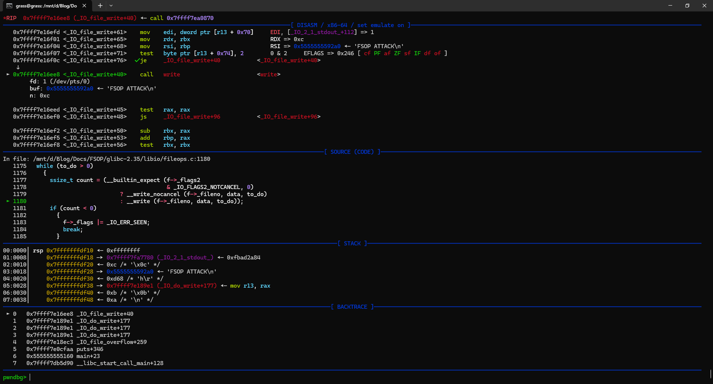

Tại thời điểm ngay trước khi gọi đến write thì ta có FILE struct như sau
```bash
pwndbg> p _IO_2_1_stdout_
$1 = {
  file = {
    _flags = -72537468,
    _IO_read_ptr = 0x5555555592a0 "FSOP ATTACK\n",
    _IO_read_end = 0x5555555592a0 "FSOP ATTACK\n",
    _IO_read_base = 0x5555555592a0 "FSOP ATTACK\n",
    _IO_write_base = 0x5555555592a0 "FSOP ATTACK\n",
    _IO_write_ptr = 0x5555555592ac "",
    _IO_write_end = 0x5555555592a0 "FSOP ATTACK\n",
    _IO_buf_base = 0x5555555592a0 "FSOP ATTACK\n",
    _IO_buf_end = 0x5555555596a0 "",
    _IO_save_base = 0x0,
    _IO_backup_base = 0x0,
    _IO_save_end = 0x0,
    _markers = 0x0,
    _chain = 0x7ffff7fa6aa0 <_IO_2_1_stdin_>,
    _fileno = 1,
    _flags2 = 0,
    _old_offset = -1,
    _cur_column = 0,
    _vtable_offset = 0 '\000',
    _shortbuf = "",
    _lock = 0x7ffff7fa8a70 <_IO_stdfile_1_lock>,
    _offset = -1,
    _codecvt = 0x0,
    _wide_data = 0x7ffff7fa69a0 <_IO_wide_data_1>,
    _freeres_list = 0x0,
    _freeres_buf = 0x0,
    __pad5 = 0,
    _mode = -1,
    _unused2 = '\000' <repeats 19 times>
  },
  vtable = 0x7ffff7fa3600 <_IO_file_jumps>
}
```

Ta thấy giá trị `stdout->_IO_write_ptr - stdout->_IO_write_base` đúng bằng 12, bằng độ dài của chuỗi mà chúng ta muốn in.

Tóm lại, flow của hàm puts từ đầu đến lúc gọi được write syscall như sau:
1. `puts` hoặc `_IO_puts`
2. `_IO_file_xsputn`
3. `_IO_file_overflow`
4. `_IO_do_write`
5. `_IO_file_write`
6. `write syscall`

**Câu hỏi đặt ra lúc này là chúng ta có thể thay đổi những trường nào bên trong FILE structure để có thể sử dụng write syscall để leak libc?**
**Và tại sao lại có thể làm được điều này?**


> `📝` Một số macro sẽ có ích trong quá trình khai thác sau này:
> ```C
> #define _IO_MAGIC 0xFBAD0000 /* Magic number */
> #define _OLD_STDIO_MAGIC 0xFABC0000 /* Emulate old stdio. */
> #define _IO_MAGIC_MASK 0xFFFF0000
> #define _IO_USER_BUF 1 /* User owns buffer; don't delete it on close. */
> #define _IO_UNBUFFERED 2
> #define _IO_NO_READS 4 /* Reading not allowed */
> #define _IO_NO_WRITES 8 /* Writing not allowd */
> #define _IO_EOF_SEEN 0x10
> #define _IO_ERR_SEEN 0x20
> #define _IO_DELETE_DONT_CLOSE 0x40 /* Don't call close(_fileno) on cleanup. */
> #define _IO_LINKED 0x80 /* Set if linked (using _chain) to streambuf::_list_all.*/
> #define _IO_IN_BACKUP 0x100
> #define _IO_LINE_BUF 0x200
> #define _IO_TIED_PUT_GET 0x400 /* Set if put and get pointer logicly tied. */
> #define _IO_CURRENTLY_PUTTING 0x800
> #define _IO_IS_APPENDING 0x1000
> #define _IO_IS_FILEBUF 0x2000
> #define _IO_BAD_SEEN 0x4000
> #define _IO_USER_LOCK 0x8000
> ```

- Đầu tiên thì để hàm `_IO_do_write()` được gọi thì ta cần bypass loạt checks sau
```c
...
if (f->_flags & _IO_NO_WRITES) /* SET ERROR */
    {
      f->_flags |= _IO_ERR_SEEN;
      __set_errno (EBADF);
      return EOF;
    }
...
if ((f->_flags & _IO_CURRENTLY_PUTTING) == 0 || f->_IO_write_base == NULL)
    {
      /* Allocate a buffer if needed. */
      if (f->_IO_write_base == NULL)
	{
	  _IO_doallocbuf (f);
	  _IO_setg (f, f->_IO_buf_base, f->_IO_buf_base, f->_IO_buf_base);
	}
    }
...
```

`if (f->_flags & _IO_NO_WRITES)` và `(f->_flags & _IO_CURRENTLY_PUTTING) == 0`cần trả về `FALSE`. Tức là ta phải set `fp->_flag` thoả mãn:
```
stdout->_flags & 8 = 0
f->_flags & 0x800 != 0
```

- Ở vị trí này thì `ch` vẫn bằng `EOF` nên đến đây là đã có thể thành công vào hàm `_IO_do_write()`

- Ở `_IO_new_do_write`, ta cần bypass các check sau:
```c
static size_t
new_do_write (FILE *fp, const char *data, size_t to_do)
{
  size_t count;
  if (fp->_flags & _IO_IS_APPENDING)
    /* On a system without a proper O_APPEND implementation,
       you would need to sys_seek(0, SEEK_END) here, but is
       not needed nor desirable for Unix- or Posix-like systems.
       Instead, just indicate that offset (before and after) is
       unpredictable. */
    fp->_offset = _IO_pos_BAD;
  else if (fp->_IO_read_end != fp->_IO_write_base)
    {
      off64_t new_pos
	= _IO_SYSSEEK (fp, fp->_IO_write_base - fp->_IO_read_end, 1);
      if (new_pos == _IO_pos_BAD)
	return 0;
      fp->_offset = new_pos;
    }
  count = _IO_SYSWRITE (fp, data, to_do);
  if (fp->_cur_column && count)
    fp->_cur_column = _IO_adjust_column (fp->_cur_column - 1, data, count) + 1;
  _IO_setg (fp, fp->_IO_buf_base, fp->_IO_buf_base, fp->_IO_buf_base);
  fp->_IO_write_base = fp->_IO_write_ptr = fp->_IO_buf_base;
  fp->_IO_write_end = (fp->_mode <= 0
		       && (fp->_flags & (_IO_LINE_BUF | _IO_UNBUFFERED))
		       ? fp->_IO_buf_base : fp->_IO_buf_end);
  return count;
}
```

Tại đây có 2 khả năng có thể xảy ra:
- Cách thử nhất là đặt điều kiện `if (fp->_flags & _IO_IS_APPENDING)` là `TRUE` để khỏi chui vào khối if bên dưới. Do vậy ta cần thêm 1 điều kiện nữa:

```
fp->_flags & _IO_IS_APPENDING = 1
```
Tổng hợp các điều kiện bên trên, ta cần có:
```
_flags & 0x8 = 0
_flags & 0x800 = 1
_flags & 0x1000 = 1
```
Do đó `_flag` cần được set là `0x1800`.

- Cách thứ hai là set `fp->_IO_read_end == p->_IO_write_base`, cũng để tránh khối điều kiện bên dưới.
Và ta được điều kiện giống như [setup](#2-arbitrary-read) bên trên

- Phần còn lại là đặt `write_base` và `write_ptr` thì hiển nhiên rồi.

Ở đây mình mới chỉ nói 1 cách để đạt được READ PRIMITIVE. 
Ngoài cách này ra thì có rất nhiều cách khác nữa có thể dẫn đến READ/WRITE PRIMITIVE từ FSOP, đặc điểm chung là chúng ta sẽ cần mò vào source code libc và tìm cách bypass các điều kiện để setup các trường và chui vào khối code mà ta muốn thực hiện.

### 4. Validation
Từ phiên bản `Glibc-2.24` trở đi, khi ta ghi đè vào `vtable` thì sẽ không còn dẫn tới RCE được nữa. Bởi vì chương trình sẽ kiểm tra tính hợp lệ của địa chỉ vtable trước khi gọi hàm ảo.
Hai hàm `IO_validate_vtable` and `_IO_vtable_check` được thêm vào.

```C
static inline const struct _IO_jump_t *
IO_validate_vtable (const struct _IO_jump_t *vtable)
{
  /* Fast path: The vtable pointer is within the __libc_IO_vtables
     section.  */
  uintptr_t section_length = __stop___libc_IO_vtables - __start___libc_IO_vtables;
  const char *ptr = (const char *) vtable;
  uintptr_t offset = ptr - __start___libc_IO_vtables;
  if (__glibc_unlikely (offset >= section_length))
    /* The vtable pointer is not in the expected section.  Use the
       slow path, which will terminate the process if necessary.  */
    _IO_vtable_check ();
  return vtable;
}
```
Hàm kiểm tra xem con trỏ `vtable` có nằm trong phần `__libc_IO_vtables` hay không, bằng cách so sánh offset giữa vtable pointer hiện tại với `__start___libc_IO_vtables` có lớn hơn offset giữa `__stop___libc_IO_vtables` và `__start___libc_IO_vtables` không. Nếu có lớn hơn thì rõ ràng là fake rồi.

> Vùng này chứa một số `vtable` thuộc kiểu `_IO_jump_t`. `vtable` gốc cũng nằm trong đó.
> Ta có thể xem địa chỉ của vùng `__libc_IO_vtables` bằng cách sử dụng gdb
> ```
> pwndbg> p __stop___libc_IO_vtables
> $1 = 0x7f4d4b09a768 ""
> pwndbg> p __start___libc_IO_vtables
> $2 = 0x7f4d4b099a00 <_IO_helper_jumps> ""
> ```
>

Nếu không thoả mãn, nó sẽ tiếp tục gọi đến `_IO_vtable_check`.

```c
void attribute_hidden
_IO_vtable_check (void)
{
#ifdef SHARED
  void (*flag) (void) = atomic_load_relaxed (&IO_accept_foreign_vtables);
#ifdef PTR_DEMANGLE
  PTR_DEMANGLE (flag);
#endif
  if (flag == &_IO_vtable_check)
    return;
  {
    Dl_info di;
    struct link_map *l;
    if (_dl_open_hook != NULL
       || (_dl_addr (_IO_vtable_check, &di, &l, NULL) != 0
            && l->l_ns != LM_ID_BASE))
      return;
  }
#else /* !SHARED */
  if (__dlopen != NULL)
    return;
#endif
  __libc_fatal ("Fatal error: glibc detected an invalid stdio handle\n");
}
```

Nếu `vtable` không hợp lệ, chương trình sẽ dừng lại và báo lỗi.
Đó là lí do mình không trình bày về `vtable hijacking` trong phần này.
Tuy nhiên thì vẫn có những cách để đạt được RCE bằng cách bypass vtable check. Điều đó dẫn ta đến phần tiếp theo: **Advance FSOP attack**

## III. Advance FSOP attack
Trong quá trình nhặt nhạnh trên mạng, mình tìm thấy một vài bài viết về bypass vtable check. Tuy nhiên do thời điểm viết bài cũng đã khá lâu nên mình cũng không biết được kĩ thuật nào còn có thể sử dụng.

Trong phần này mình sẽ cố gắng dựng lại các cách tấn công, nhưng sử dụng trên `libc-2.35`, để tìm những cách tấn công còn có thể sử dụng trong các libc hiện tại.

### 1. Đầu tiên là cách tấn công của `Dhaval Kapil`
#### 1.1. Ý tưởng
Với cách tấn công này, ta sẽ làm cho `vtable` trỏ đến một địa chỉ đã nằm sẵn bên trong vùng `__libc_IO_vtables`. `_IO_str_jumps` cũng nằm ở đây. Nó chứa một con trỏ tới hàm `_IO_str_overflow` rất hữu ích cho việc tấn công của chúng ta.

```C
/* Source: https://code.woboq.org/userspace/glibc/libio/strops.c.html#_IO_str_overflow
*/

_IO_str_overflow (_IO_FILE *fp, int c)
{
  int flush_only = c == EOF;
  _IO_size_t pos;
  if (fp->_flags & _IO_NO_WRITES)
      return flush_only ? 0 : EOF;
  if ((fp->_flags & _IO_TIED_PUT_GET) && !(fp->_flags & _IO_CURRENTLY_PUTTING))
    {
      fp->_flags |= _IO_CURRENTLY_PUTTING;
      fp->_IO_write_ptr = fp->_IO_read_ptr;
      fp->_IO_read_ptr = fp->_IO_read_end;
    }
  pos = fp->_IO_write_ptr - fp->_IO_write_base;
  if (pos >= (_IO_size_t) (_IO_blen (fp) + flush_only))
    {
      if (fp->_flags & _IO_USER_BUF) /* not allowed to enlarge */
        return EOF;
      else
    {
      char *new_buf;
      char *old_buf = fp->_IO_buf_base;
      size_t old_blen = _IO_blen (fp);
      _IO_size_t new_size = 2 * old_blen + 100;
      if (new_size < old_blen)
        return EOF;
      new_buf
        = (char *) (*((_IO_strfile *) fp)->_s._allocate_buffer) (new_size);

        /* ^ Getting RIP control !*/

```

Chúng ta sẽ ghi đè `vtable` theo cách sao cho thay vì gọi hàm liên kết `FILE` thông thường, `_IO_str_overflow` sẽ được gọi. Vì chúng ta đã có thể giả mạo `fp` nên chúng ta có thể kiểm soát luồng thực thi, bằng cách kiểm soát ba tham số đầu tiên trong dòng này:
```C
(char *) (*((_IO_strfile *) fp)->_s._allocate_buffer) (new_size);
```

#### 1.2. Demo

> Theo lời anh Khánh nói thì nếu không có demo thiên hạ sẽ bảo ta nói láo.

### 2. Pwn college 

#### 2.1. Về ý tưởng
Cũng như bên trên, ta sẽ tìm cách để gọi đến `IO_wfile_overflow`
Hàm này gọi đến `do_allocbuf`
Hàm này sử dụng vtable (`file -> wide_data`) mà không cần phải verify.

**Đôi nét về `wide_data` trước**
> `wide_data` là một trường tồn tại ở các FILE structure hiện đại.
> Nó được tạo để xử lí các wide character stream (ex: unicode)
> Chứa các trường tương tự như FILE.
> Nó cũng chứa cả vtable pointer luôn.

Trong libc 2.40, [`wide_data`]([`wide_data`](https://elixir.bootlin.com/glibc/glibc-2.40.9000/source/libio/libio.h#L121)) được định nghĩa như sau:
```c
/* Extra data for wide character streams.  */
struct _IO_wide_data
{
  wchar_t *_IO_read_ptr;	/* Current read pointer */
  wchar_t *_IO_read_end;	/* End of get area. */
  wchar_t *_IO_read_base;	/* Start of putback+get area. */
  wchar_t *_IO_write_base;	/* Start of put area. */
  wchar_t *_IO_write_ptr;	/* Current put pointer. */
  wchar_t *_IO_write_end;	/* End of put area. */
  wchar_t *_IO_buf_base;	/* Start of reserve area. */
  wchar_t *_IO_buf_end;		/* End of reserve area. */
  /* The following fields are used to support backing up and undo. */
  wchar_t *_IO_save_base;	/* Pointer to start of non-current get area. */
  wchar_t *_IO_backup_base;	/* Pointer to first valid character of
				   backup area */
  wchar_t *_IO_save_end;	/* Pointer to end of non-current get area. */

  __mbstate_t _IO_state;
  __mbstate_t _IO_last_state;
  struct _IO_codecvt _codecvt;

  wchar_t _shortbuf[1];

  const struct _IO_jump_t *_wide_vtable;
};
```

**Fully exploit**
1. Fake `file._wide_vtable` tại 1 vùng nhớ ta kiểm soát được.
2. `file.wide_data -> vtable` trỏ đến exploit_vtable
3. overwrite `file.vtable` sao cho `IO_wfile_overflow` được gọi.
4. `_IO_wdoallocbuf` sẽ được gọi.
5. `_IO_wdoallocbuf` sẽ gọi `_IO_wide_data.vtable` **with no check**.
#### 2.2. Demo
Ở đây mình sẽ sử dụng chương trình [demo1.c](super_duper_couscous/Advanced_FSOP/pwn_college/demo1.c), libc sử dụng là 2.35 của ubuntu-22.04.

Luồng hoạt động của chương trình này khá đơn giản. Chỉ là leak hết tất cả mọi thứ có thể leak cho người dùng(theo mình thấy thì để thực hiện tấn công sẽ cần ít nhất là heap base và libcbase + có chỗ để fake `_wide_data`). Ngoài ra cũng cho người dùng quyền ghi đè và thay đổi file structure. Mục tiêu là chuyển luồng chương trình về `win`.

Đại khái là mục tiêu như thế này

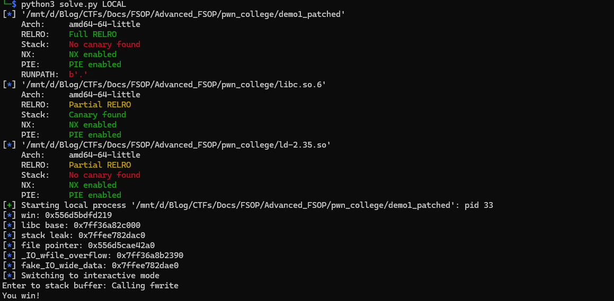

**Ý tưởng exploit:** 
- Tạo fake `wide_data` và fake `vtable` ở `stack` (`_flag` sẽ cần được tính để có thể gọi đến `IO_wfile_overflow` và `_IO_wdoallocbuf`)
- overwrite `file_pointer.vtable` sao cho `IO_wfile_overflow` được gọi.
- overwrite `file_pointer._wide_data` trỏ đến fake `_wide_data` ở stack
- `_IO_wdoallocbuf` sẽ gọi `_IO_wide_data.vtable` **with no check**.

> Trong quá trình thực hiện demo thì payload mình bị vtable check chém một lần. Hụt hẫng các thứ vì nghĩ là mất công setup nma lại gặp kĩ thuật không dùng được.
> 
> 
> 
> Ở dưới phần comment cũng không khá khẩm hơn.
>
> 
>
> 
>
> Ban đầu dự định của mình phần này là các bước để dẫn đến exploit fail. Nhưng sáng hôm sau đọc lại source code libc thì khả năng là cách tấn công này vẫn có thể áp dụng được.
> Thay vì chán nản thì mình chuyển qua lười. 
> Mình cũng đã modify demo1.c một chút để thuận tiện cho việc demo hơn.

Về quá trình debug rồi setup các địa chỉ thì mình sẽ không viết lại nữa. Thực sự là ý tưởng giống hệt như trên. POC (hơi đần tí) có thể tham khảo ở [solve.py](super_duper_couscous/Advanced_FSOP/pwn_college/solve.py)

Giải thích qua một tí lí do ta có thể gọi `win` mà không bị vtable check chém
- Ta xét hàm `_IO_wdoallocbuf`
```C
void
_IO_wdoallocbuf (FILE *fp)
{
  if (fp->_wide_data->_IO_buf_base)
    return;
  if (!(fp->_flags & _IO_UNBUFFERED))
    if ((wint_t)_IO_WDOALLOCATE (fp) != WEOF)
      return;
  _IO_wsetb (fp, fp->_wide_data->_shortbuf,
		     fp->_wide_data->_shortbuf + 1, 0);
}
libc_hidden_def (_IO_wdoallocbuf)
```

Ta gọi hàm `win` thông qua `_IO_WDOALLOCATE (fp)`

- `_IO_WDOALLOCATE (fp)` lại được định nghĩa như sau:

```C
#define _IO_WDOALLOCATE(FP) WJUMP0 (__doallocate, FP)
```

Đây chính là điểm tạo ra khác biệt. 
Khi mình so sánh code của 2 macro `JUMP0` và `WJUMP0` thì thấy `WJUMP0` hoàn toàn không gọi đến `IO_validate_vtable`

- `JUMP0` nè

```C
#define _IO_DOALLOCATE(FP) JUMP0 (__doallocate, FP)
#define JUMP0(FUNC, THIS) (_IO_JUMPS_FUNC(THIS)->FUNC) (THIS)

# define _IO_JUMPS_FUNC(THIS) \
  (IO_validate_vtable                                                   \
   (*(struct _IO_jump_t **) ((void *) &_IO_JUMPS_FILE_plus (THIS)	\
			     + (THIS)->_vtable_offset)))
``` 

- `WJUMP0` nè

```C
#define _IO_WDOALLOCATE(FP) WJUMP0 (__doallocate, FP)
#define WJUMP0(FUNC, THIS) (_IO_WIDE_JUMPS_FUNC(THIS)->FUNC) (THIS)
#define _IO_WIDE_JUMPS_FUNC(THIS) _IO_WIDE_JUMPS(THIS)
#define _IO_WIDE_JUMPS(THIS) \
  _IO_CAST_FIELD_ACCESS ((THIS), struct _IO_FILE, _wide_data)->_wide_vtable
```
Nói chung là không có cái check nào ở đây cả.

**🥳 +1 kĩ thuật dùng được**

### 3. FSROP
# Refs
- https://stackoverflow.com/questions/1658476/c-fopen-vs-open
- https://stackoverflow.com/questions/38652953/what-does-stream-mean-in-c
- https://hackmd.io/@kyr04i/SkF_A-fnn#2-DIVING-INTO-GLIBC-CODE
- https://chovid99.github.io/posts/file-structure-attack-part-1/
- https://dhavalkapil.com/blogs/FILE-Structure-Exploitation/
- https://www.slideshare.net/slideshow/play-with-file-structure-yet-another-binary-exploit-technique/81635564
- https://www.youtube.com/watch?v=Fr3VU5hdL4s&t=1245s&ab_channel=HackInTheBoxSecurityConference
- https://ctf-wiki.mahaloz.re/pwn/linux/io_file/introduction/
- https://www.youtube.com/watch?v=vkUR58xxSFI&list=PL-ymxv0nOtqrD-3LwVyyUu83kNJBI9RVL&t=10s
- https://github.com/mahaloz/ctf-wiki-en/blob/master/docs/pwn/linux/io_file/exploit-in-libc2.24.md