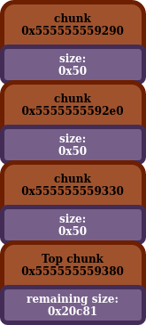
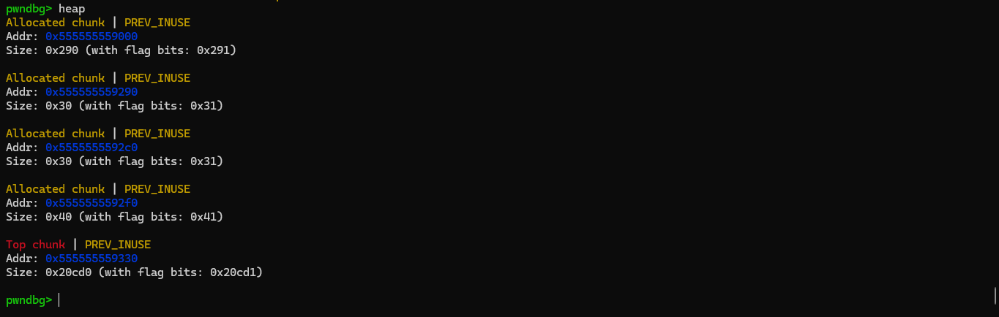
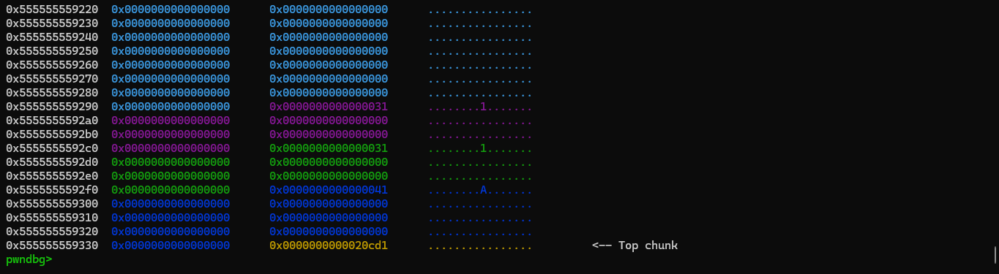
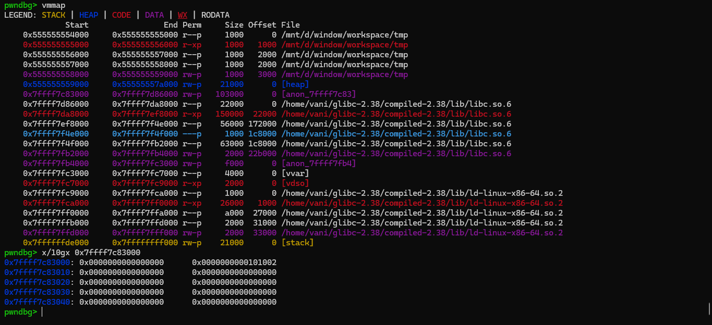

# Basic Heap

- [back](readme.md)

So the purpose of this is to cover some basic information about how the heap works, which will be needed later on.

## What is the heap?

You probably know this. <mark>The heap is a system which will allow you to dynamically allocate space within your code</mark>. You typically allocate memory with `malloc`, and deallocate it with `free`.

## Chunk Size vs Request Size

Now, when you go ahead and call `malloc`, you pass it an argument. This argument is the minimum size you want for the user data section of the malloc chunk you are requesting to be allocated. <mark>The actual size of the chunk will be larger than the size you pass it</mark>. This is for several reasons. First off, the malloc chunk will need to store a chunk header, in addition to the data that you wish to store there. <mark>This heap header contains data about the chunk</mark>, which will need to be used later on. In addition to that, <mark>malloc likes to round up chunks to the nearest `0x10` byte divisible size</mark>, so that may also increase the size of the chunk.

The <mark>size you request from malloc</mark>, is typically <mark>known as either the request or the user size</mark>. The <mark>actual total size of the chunk is known as the chunk size</mark>. Also <mark>the section of the heap chunk</mark> which is supposed to <mark>hold the data</mark> the programmer wants to store, I call it the <mark>user data section</mark>. The <mark>ptr (pointer) returned by malloc is directly to that region</mark>.

## Binning

> Đoạn này discuss cách heap hoạt động.

So, take a look at this code:

```
#include <stdio.h>
#include <stdlib.h>

void main(void) {
    char *ptr0, *ptr1, *ptr2;

    ptr0 = malloc(0x450);
    ptr1 = malloc(0x450);
    ptr2 = malloc(0x450);

    puts("I have three malloc chunks!");

}
```

Which at that puts call, the heap will look something like this:



This is the in memory representation of that. This might not make a lot of sense right now, but it might later:
```
gef➤  x/50g 0x555555559290
0x555555559290:    0x0    0x51
0x5555555592a0:    0x0    0x0
0x5555555592b0:    0x0    0x0
0x5555555592c0:    0x0    0x0
0x5555555592d0:    0x0    0x0
0x5555555592e0:    0x0    0x51
0x5555555592f0:    0x0    0x0
0x555555559300:    0x0    0x0
0x555555559310:    0x0    0x0
0x555555559320:    0x0    0x0
0x555555559330:    0x0    0x51
0x555555559340:    0x0    0x0
0x555555559350:    0x0    0x0
0x555555559360:    0x0    0x0
0x555555559370:    0x0    0x0
0x555555559380:    0x0    0x20c81
0x555555559390:    0x0    0x0
0x5555555593a0:    0x0    0x0
0x5555555593b0:    0x0    0x0
0x5555555593c0:    0x0    0x0
0x5555555593d0:    0x0    0x0
0x5555555593e0:    0x0    0x0
0x5555555593f0:    0x0    0x0
0x555555559400:    0x0    0x0
```

So, we see there are three chunks <mark>adjacent to each other in memory</mark>, with the <mark>last one bordering</mark> something known as <mark>the `top`</mark>. How the heap works, is it <mark>starts off with a single contiguous block of memory</mark>. When the heap needs to <mark>allocate more memory</mark> (assuming it can't use recycled memory) and it needs to actually <mark>create new chunks</mark>, it will <mark>split off a small piece of the top chunk</mark> to use for this. The `top` ptr is simply a ptr to an address, which is at the border between the unallocated portion (which can have chunks split off from to make new chunks), and the area of memory which has had chunks that have been allocated (although they might have been freed after being allocated). The <mark>actual value stored at the memory location</mark> the <mark>`top` ptr points to</mark>, is supposed to say <mark>how much space is left</mark> in the top chunk (I've also heard it called the heap wilderness).

Now we allocated three chunks, with the specified size being `0x40`. We see here, the actual size of the chunks are `0x50`. The <mark>size of the chunk</mark> is <mark>stored in</mark> the <mark>heap header</mark>. Now it looks like their size is `0x51`. That is because the <mark>`1` bit is a flag</mark>, to signify the <mark>previous heap chunk is in use</mark>. The heap (and also the `top` chunk) is initialized the first time that malloc is called. After the first chunk was malloc'd, the top chunk was `0x5555555592e0`. After the second allocation it was `0x555555559330`, and the third was `0x555555559380`. We can see here that the <mark>heap is growing towards higher addresses</mark>. In addition to that, every time the top chunk ptr shifted by `0x50` bytes, because that was the size of the chunk that we were allocating.

Now, taking a look back at the diagram, we see chunk `0` is at `0x555555559290`, chunk `1` is at `0x5555555592e0`, and chunk `2` is at `0x555555559330`. This is of course, to `0x10` bytes backwards from the ptr that malloc returned to us (remember, the ptr malloc gives us is to the start of the user data section of the chunk, not the start of the chunk). Now, what if we were to started to free some of these chunks?

If we were to free chunk `2` in place of that `puts` call, it <mark>would enter into something called the tcache</mark> (will be discussed later) <mark>since it's such a small chunk</mark>, and the tcache has some empty spaces. However <mark>if it was a larger chunk</mark> (let's say `0x460` bytes instead of `0x50`) malloc would actually <mark>merge it into the top chunk</mark>. <mark>However</mark> this would be a different story if we just <mark>freed chunk `1`</mark>. Since <mark>chunk `1` isn't adjacent to the top chunk</mark>, we <mark>can't merge</mark> it back into the top chunk when it's freed. <mark>In order for two chunks to be merged</mark>, <mark>they must be adjacent</mark> in memory.

This is leading into something called fragmentation. Just because you have `0x10000` bytes of free space, that doesn't mean you can allocate a `0x10000` byte chunk, since it might not all be one contiguous space. Now to help decrease the downsides to heap fragmentation and improve performance, the libc heap has a lot of different binning mechanisms, which are designed to reuse freed chunks in future malloc allocations. Most of the information in here will be dealing with those various binning mechanisms.

Also one more thing to note. A <mark>lot of functions (like `puts`) also call malloc</mark>, and thus can <mark>affect the state of the heap</mark>.

## Hình ảnh của một chunk

Demo code:
```
#include <stdio.h>
#include <stdlib.h>

void main(void) {
    char *ptr0, *ptr1, *ptr2, *ptr3;

    ptr0 = malloc(0x20);
    ptr1 = malloc(0x28);
    ptr2 = malloc(0x30);
    ptr3 = malloc(0x100000);
    puts("I have 4 malloc chunks!");

}
```





Một chunk là những block cùng màu. (Như vậy malloc size `0x20` hoặc `0x28` đều trả về 1 chunk giống nhau, `malloc(0x20)` nhưng thực chất có thể dùng `0x28`).

Khi `malloc` một chunk size vượt mức top chunk, chương trình sẽ tạo một vùng mới nằm ngay dưới `libc`.



## Flag bit

> Lấy từ guyintuxedo

Also <mark>the first three bits of the malloc size are flags which specify different things (part of the reason for rounding). If the bit is set, it means that whatever the flag specifies is true (and vice versa)</mark>:
```
0x1:     Previous in Use     - Specifies that the chunk before it in memory is in use
0x2:    Is MMAPPED               - Specifies that the chunk was obtained with mmap()
0x4:     Non Main Arena         - Specifies that the chunk was obtained from outside of the main arena
```
